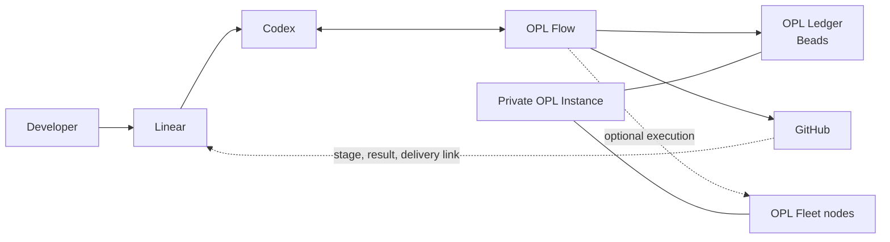

<p align="center">
  
</p>

<p align="center">
  <a href="./README.md"><strong>English</strong></a> | <a href="./README.zh-CN.md">中文</a>
</p>

<h1 align="center">OPL Flow</h1>

<p align="center"><strong>The model-native workflow and collaboration layer for an AI development fleet</strong></p>
<p align="center">Raise the floor for one Codex. Keep many agents, repositories, and machines moving from one durable source of truth.</p>

<p align="center">
  
</p>

## Why OPL Flow

Codex can already reason, write code, use tools, and coordinate agents. The
harder problem begins when development lasts longer than one conversation or
spreads across several tasks, repositories, and machines:

- Which task owns the current objective, and what is ready next?
- Which result has reached the canonical repository rather than a temporary branch?
- How can work continue on another machine without copying private runtime state?
- How can a person see progress without turning a project board into a second source of truth?
- How can the workflow remain useful when the Ledger, Linear, or Fleet is absent?

**OPL Flow provides that continuity without replacing Codex's native
intelligence.** It starts as a small user-level Profile and a set of workflow
Skills. When a project needs more, the same Flow can add a durable Beads-backed
Ledger, an optional Linear portal, and an optional multi-machine Fleet engine.

## One-Sentence Model

**Codex does the work. OPL Flow organizes how work continues. OPL Ledger keeps
task truth. Linear makes that truth easy for people to read. OPL Fleet provides
the machines that can execute it.**

Every layer is independently optional except the executor itself. A single
developer can use only the Profile and Skills; a larger personal lab can enable
the complete stack without changing the underlying development model.

## From One Codex To An AI Fleet

| Scale | What OPL Flow adds | What stays native or owner-managed |
| --- | --- | --- |
| One machine | A concise user Profile, workflow preferences, and reusable Skills | Codex reasoning, tools, project files, and repository instructions |
| Several active tasks | Ownership, recovery, fresh-SSOT integration, and closeout conventions | Codex native multi-agent and conversation coordination |
| Long-lived work | OPL Ledger initialization and idempotent reconciliation | Beads owns the database, dependency graph, claims, and Dolt sync |
| Human visibility | The official Linear/Codex intake and narrow progress writeback | Linear is a portal, not task truth or an agent dispatcher |
| Several machines | A reusable Fleet engine for status, admission, repository currentness, and dispatch policy | Each machine installs from component owners; a private Instance owns topology and policy |

This is why OPL Flow is no longer only an OPL App companion module. It remains
an optional default workflow Profile for the App, while also standing on its
own as the public workflow layer for model-native, multi-agent, multi-machine
development.

## How The Pieces Fit



| Component | Authority |
| --- | --- |
| **Codex** | Reasoning, tool use, implementation, and native agent coordination |
| **OPL Flow** | Profile, workflow Skills, reconciliation, Git/worktree lifecycle, and the reusable Fleet engine |
| **OPL Ledger** | Durable internal task SSOT, implemented by Beads rather than a custom OPL database |
| **GitHub** | Branch, PR, CI, merge, and release evidence authority |
| **Linear** | Optional human intake and progress portal with narrow Codex/GitHub writeback |
| **OPL Fleet** | Optional machine execution and admission using fresh node evidence |
| **OPL Instance** | Private ledger data, Fleet topology, policy, assets, and personal overlays |

Flow does not become a central planner. It does not decide domain truth,
quality, release acceptance, or what the model must think next. Beads does not
wake Codex, Linear does not become an agent scheduler, and Fleet does not copy private
sessions or tool binaries between machines. The normal intake path is Linear's
official Codex integration; Beads' Linear adapter is reserved for migration,
recovery, and audit rather than daily full mirroring.

## Core Capabilities

### Model-Native Profile

The user Profile raises the development baseline without installing a rigid
methodology. It keeps communication preferences, source-first diagnosis,
critical-path focus, dynamic concurrency, and tool routing concise and
portable.

### Durable OPL Ledger

OPL Flow provides safe initialization, status, and Operations Registry
reconciliation. Ordinary task operations use the owner-provided `bd` CLI
directly. Beads remains the storage and synchronization authority.

### Optional Linear Portal

Flow documents and reports the official Linear/Codex connection. Codex creates
or links the Bead after accepting a Linear task, then writes only stage,
blocker, result, and delivery links back to Linear. The Beads Linear adapter is
used only for migration, recovery, and audit; it never becomes a daily full
mirror and never stores an API key in Flow, Git, or task text.

### Optional OPL Fleet

The generic Fleet engine lives in this public repository. A private OPL
Instance supplies node IDs, capabilities, scheduling policy, runner bindings,
and sanitized receipts. Nodes update software from each component's official
owner channel instead of copying the controller's bytes or version.

### Git And Worktree Continuity

Flow includes lifecycle and absorption tools for recoverable parallel Git work.
Independent worktrees may progress concurrently, including overlapping write
sets. Integration resolves conflicts against fresh canonical state; a worktree
or pull request is never mistaken for the final SSOT.

### Dynamic Composition

OPL Packages and capabilities update independently. Normal dependencies use a
stable identity and callability, not a shared ecosystem version lock. Exact
commit and digest binding is limited to proving one immutable release candidate.

## Core Skills And Optional Enhancements

OPL Flow `0.1.29` bundles two core Skills with the Plugin:

- `opl-flow` for setup, update, status, Ledger, Linear, and Fleet entry points;
- `coordinate-concurrent-tasks` for concurrent tasks, conversations, and Git
  worktrees.

[`gaofeng21cn/opl-skills`](https://github.com/gaofeng21cn/opl-skills) is the
independently installable public enhancement pack. It supplies architecture,
delivery, reliability, learning, and artifact workflows without becoming a
runtime dependency of OPL Flow. Codex discovers the installed Skills and routes
to them by task intent; Flow does not copy or dynamically import their source.

The source consolidation is not yet complete. `develop-and-deliver`,
`task-mode-gate`, and `recover-codex-tasks` remain owned by OPL Skills until
their single-source migration into OPL Flow is completed. In contrast,
`architect-and-simplify` remains an optional enhancement.

Install the complete public enhancement pack from its owner:

```bash
npx skills add gaofeng21cn/opl-skills -g -a codex -s '*' -y --full-depth
```

A private OPL Instance may record the selected enhancement inventory for its
Fleet. Each node still installs and updates from the component owner; Fleet
checks capability presence without copying Skill bytes between machines.

## Start In One Codex Action

Install the OPL Flow Plugin from its public repository:

```bash
codex plugin marketplace add gaofeng21cn/opl-flow
codex plugin add opl-flow@opl-flow-local
```

Start a new Codex conversation or CLI session, then ask:

```text
Use $opl-flow setup to initialize my reusable development workflow.
```

To include the optional public enhancement pack in the same guided action:

```text
Use $opl-flow setup to initialize my development workflow and install the OPL Skills public enhancement pack.
```

For an existing installation:

```text
Use $opl-flow update to update every component from its owner and verify the effective workflow.
```

The Skill handles the end-to-end action and asks only when an external
authorization is unavoidable. Core setup does not require Linear or Fleet.

## Choose The Deployment You Need

| Deployment | Components | Best for |
| --- | --- | --- |
| **Core** | Codex + OPL Flow Profile and Skills | One developer on one machine |
| **Durable** | Core + private OPL Instance + Beads | Long-running work and many active tasks |
| **Visible** | Durable + Linear | A human-readable project and operations portal |
| **Fleet** | Durable + enrolled machines | Multi-machine development, testing, and compute |

Adding a layer does not change the authority of the layers below it. Removing
an optional layer leaves Core usable.

## Public And Private Boundary

The reusable engine belongs here. Personal state does not.

**Public OPL Flow source includes:**

- Profile sources and workflow Skills;
- Beads and Linear adapters without credentials;
- the generic Fleet engine and schemas;
- Git/worktree lifecycle and verification tools;
- setup, update, status, and documentation.

**A private OPL Instance includes:**

- Beads/Dolt task data;
- machine inventory, SSH routes, runner bindings, and dispatch policy;
- private Skills, repository governance, deployment notes, and asset records;
- sanitized receipts and personal workflow overlays.

Credentials, sessions, conversation history, logs, caches, private machine
paths, and Fleet lease secrets are never published or copied between nodes.

## Product Relationship

| Product | Role |
| --- | --- |
| **OPL Flow** | Workflow and collaboration layer for the AI development fleet |
| **OPL Framework** | Runtime, Package lifecycle, contracts, and Agent execution substrate |
| **One Person Lab App** | User-facing workbench and optional Flow carrier/profile entry |
| **OPL Skills** | Optional reusable capability enhancements |
| **OPL Instance** | One owner or organization's private operating configuration and state |

OPL Flow is an `OPL Package(kind=workflow_profile)`, but its product meaning is
larger than a profile file: it packages the reusable operating model around the
Profile while preserving native Codex behavior and independent owners.

## Machine-Readable Entry Points

<details>
<summary><strong>Developer and automation commands</strong></summary>

```bash
# Combined readback
python3 scripts/opl_workflow.py status --instance <opl-instance>

# Profile
python3 scripts/opl_workflow.py profile status
python3 scripts/opl_workflow.py profile prepare

# Ledger
python3 scripts/opl_workflow.py ledger init --instance <opl-instance>
python3 scripts/opl_workflow.py ledger reconcile-operations --instance <opl-instance>
(cd <opl-instance> && bd ready --json)
(cd <opl-instance> && bd dolt pull)
(cd <opl-instance> && bd dolt push)

# Linear migration/audit adapter (not the daily intake path)
(cd <opl-instance> && bd linear status --json)
(cd <opl-instance> && bd linear sync --dry-run --json)

# Optional Fleet
python3 scripts/opl_workflow.py fleet --instance <opl-instance> status
python3 scripts/opl_workflow.py fleet --instance <opl-instance> repos status

# Source verification
scripts/verify.sh
scripts/verify.sh full
```

The old `codex-fleet` command is a transition fallback for existing private
installations. New reusable Fleet capability is source-owned by OPL Flow.

</details>

## Architecture And Operations

- [Reusable workflow architecture](docs/reusable-workflow-architecture.md)
- [Capability composition and ownership](docs/capability-governance.md)
- [New machine setup](docs/new-machine-codex-setup.md)
- [Current implementation status](docs/status.md)
- [Documentation index](docs/README.md)

These documents contain exact ownership, carrier, Profile-safety, release
qualification, and migration details. A passing test, tag, candidate, or
published image is not a substitute for fresh installed readback.

## License

[MIT](LICENSE)
