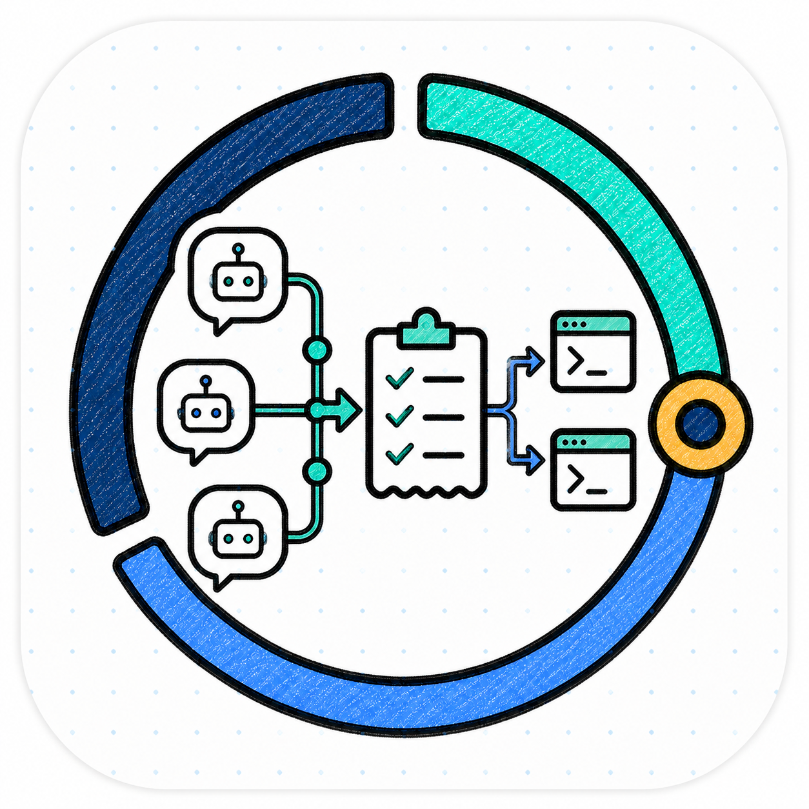
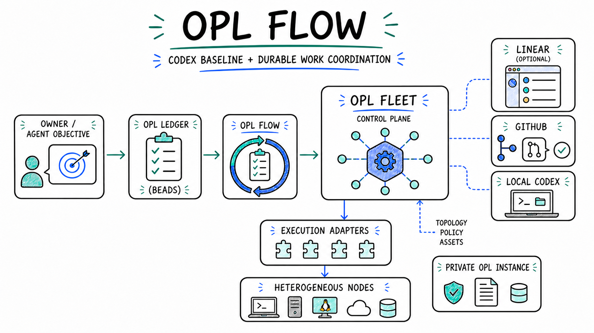
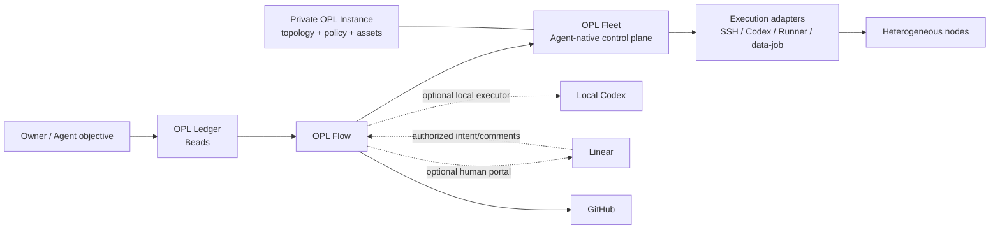

<p align="center">
  
</p>

<p align="center">
  <a href="./README.md"><strong>English</strong></a> | <a href="./README.zh-CN.md">中文</a>
</p>

<h1 align="center">OPL Flow</h1>

<p align="center"><strong>The Codex baseline and durable work-coordination layer</strong></p>
<p align="center">Raise the floor for one Codex, then connect durable work truth to OPL Fleet's Agent-native distributed execution and continuity system.</p>

<p align="center">
  
</p>

## Why OPL Flow

Codex can already reason, write code, use tools, and coordinate agents. Two
product problems remain outside that native intelligence:

- establish a dependable usage floor for one Codex: a concise `AGENTS.md`,
  model/reasoning recommendation, effective context boundaries, and the
  recommended research, document authoring, and extraction capabilities;
- preserve execution continuity when work spans conversations, tasks,
  repositories, and machines.

The second problem introduces familiar questions:

- Which task owns the current objective, and what is ready next?
- Which result has reached the canonical repository rather than a temporary branch?
- How can work continue on another machine without copying private runtime state?
- How can a person see progress without turning a project board into a second source of truth?
- How can the workflow remain useful when the Ledger, Linear, or Fleet is absent?

**OPL Flow is the Codex experience baseline and work-coordination control
layer.** It provides the small user-level Profile, model policy, capability
intent, and core workflow Skills that establish the baseline. When work needs
durability or capacity, the same Flow adds a Beads-backed Ledger, a complete
narrow-field Linear projection, and an optional Agent-native distributed
execution and task-continuity control plane.

Flow remains optional. Its absence must not block OPL App, OPL Base, plain
Codex, another Package, or domain work. A missing recommended baseline
capability degrades the experience and offers repair; it does not make Flow
inoperable.

## One-Sentence Model

**Codex and worker Agents do the work. OPL Flow establishes the Codex baseline
and coordinates work from durable truth. OPL Ledger is the owner's complete
human work ledger. OPL Fleet is the Agent-native distributed execution and
continuity control system; Linear and GitHub remain optional human-facing and
delivery authorities.**

`OPL Ledger` names the ledger, not its supervisor, and it is not limited to OPL
source development. The one local hourly supervisor is named
`OPL Flow Supervisor` and can cover one or more registered Linear projects.

Every layer is independently optional except the executor itself. A single
developer can use only the Profile and Skills; a larger personal lab can enable
the complete stack without changing the underlying development model.

## From One Codex To An AI Fleet

| Scale | What OPL Flow adds | What stays native or owner-managed |
| --- | --- | --- |
| One machine | A concise user Profile, model recommendation, capability baseline, and reusable Skills | Codex reasoning, live model catalog, tools, project files, and repository instructions |
| Several active tasks | Ownership, recovery, fresh-SSOT integration, and closeout conventions | Codex native multi-agent and conversation coordination |
| Long-lived work | OPL Ledger initialization and idempotent reconciliation | Beads owns the database, dependency graph, claims, and Dolt sync |
| Human visibility | Complete Linear projection of every user-ledger task with a narrow field set | Linear is a portal, not task truth or an agent scheduler |
| Several machines | Agent-native distributed execution, workspace currentness, owner-safe task continuation, and task-capacity dispatch | Each machine installs from component owners; a private Instance owns topology and policy; the Ledger remains task truth |

This is why OPL Flow is no longer only an OPL App companion module. It remains
an optional default workflow Profile for the App, while also standing on its
own as the public workflow layer for model-native, multi-agent, multi-machine
development.

## How The Pieces Fit



| Component | Authority |
| --- | --- |
| **Codex** | Reasoning, tool use, implementation, and native agent coordination |
| **OPL Flow** | Profile and model recommendation, capability intent, workflow Skills, reconciliation, Git/worktree lifecycle, and the reusable Fleet engine |
| **OPL Ledger** | The owner Instance's complete human work ledger and durable internal task SSOT, implemented by Beads rather than a custom OPL database |
| **OPL Flow Supervisor** | One local hourly supervision loop for all registered Linear projects, Dashboard work, and Ledger reconciliation |
| **GitHub** | Branch, PR, CI, merge, and release evidence authority |
| **Linear** | One or more registered human-readable projects covering every ledger task, limited to intent, hierarchy, priority, due, status, short blocker/result, and links |
| **OPL Fleet** | Agent-native distributed execution and continuity control system using fresh node, workspace, owner, and capacity evidence, plus the read-only Ambient Ops observability extension |
| **OPL Instance** | Private ledger data, Fleet topology, policy, assets, and personal overlays |

Flow does not become a central planner. It does not decide domain truth,
quality, release acceptance, or what the model must think next. Beads does not
wake Codex, Linear does not become an agent scheduler, and Fleet does not copy
private sessions or tool binaries between machines. Codex maintains Linear
through the official Connector: every user-ledger Bead is visible, while the
projected fields stay intentionally narrow. Linear does not replace Beads/Dolt.
Registered projects are local-Codex managed by default; a Codex Cloud delegate
conflicts with this route and fails closed.

## Core Capabilities

### Model-Native Profile

The user Profile raises the development baseline without installing a rigid
methodology. It keeps communication preferences, source-first diagnosis,
critical-path focus, dynamic concurrency, and tool routing concise and
portable.

Flow recommends `gpt-5.6-sol` with `max` reasoning. Explicit user selection has
priority. OPL App owns Auto resolution, the visible model controls, persistence,
and fallback when Flow is unavailable; Flow does not inject a hidden prompt or
claim that a model missing from the live Codex catalog is usable.

### Three Independent Status Planes

- `package_operational`: Flow itself is installed, enabled, and callable.
- `experience_baseline`: recommended research, Office, and extraction
  capabilities are current or `degraded`; degradation offers repair but does
  not block Flow.
- `specialized_capabilities`: optional enhancements are present or absent;
  absence is normal and has no repair requirement.

Framework projects these planes generically. App consumes that projection and
does not parse `workflow-policy.json` or maintain a second companion list.

The ownership path is one-way:

```text
Flow policy -> Framework compiler -> materialization/status/build lock -> App
```

App first-run `recommended_skills` is therefore derived from the installed
Flow strategy. Agent Reach appears through the Flow baseline rather than an
App catalog. If Agent Reach is missing, Framework reports a degraded
internet-research bundle and an owner-supported repair action; it does not
disable Flow, Ledger, or the core Skills.

### Durable OPL Ledger

OPL Flow provides safe initialization, status, and Operations Registry
reconciliation. Ordinary task operations use the owner-provided `bd` CLI
directly. Beads remains the storage and synchronization authority. The Ledger
contains the owner's complete human work inventory, not only OPL repositories
or software-development work.

### Optional Linear Portal

One `OPL Flow Supervisor` can supervise one or more registered Linear projects;
the current default registration is `OPL Ledger`. Codex maintains one Linear
issue for every user-ledger Bead through the official Linear Connector and
preserves parent/child hierarchy. Every registered issue is local-managed by
default. `codex-paused` is the sole explicit dispatch pause and blocks dispatch
only: reconciliation and authorized user-comment intake keep running.

Lifecycle and current activity remain separate. Beads keeps the durable
`open`, `in_progress`, `blocked`, `deferred`, `closed`, and `pinned` lifecycle,
while OPL Flow records one execution mode: `active`, `waiting_user`,
`waiting_external`, `monitoring`, `on_demand`, or `aggregate`. Linear displays
`Todo`, `In Progress`, `Needs Action`, `Blocked`, `Monitoring`, `On Demand`,
`Backlog`, or `Done` from that combination.
`Needs Action` identifies owner login, decision, or authorization; `Blocked`
identifies an external dependency or event. Neither means an Agent remains
allocated. Both preserve an existing Beads `blocked` lifecycle and otherwise
preserve `in_progress`; `Monitoring` normalizes to `in_progress`. Only
genuinely active work is shown as `In Progress`.

`Monitoring` is a durable Ledger responsibility, not a requirement to keep an
idle Codex task open. `On Demand` is the explicit record-only state for a
long-lived responsibility with no current work, external event, or user action:
the Bead is `pinned`, the Linear issue is `On Demand`, and no execution thread
or resident monitor is allocated. It returns to `In Progress` only after a new
user instruction or explicit trigger. Only a genuine workbench or Supervisor remains
available as a long-lived task. A periodic or event-driven objective clears its live
`execution_thread` after each bounded episode, retains the completed thread as
provenance, and binds a new bounded executor only when its due date or trigger
fires. The Bead and Linear issue remain the stable identity throughout.

The Supervisor uses the official `linear_list_comments` route, a per-project
Linear comment-ID high-watermark, and the comment ID as the idempotency key.
Native owner-tool preflight keeps `list_threads.limit <= 50` and distinguishes
invalid arguments, permission denial, unknown timeout, and genuine tool
unavailability. Its hourly no-change path calls `list_threads` once, batches
live executors through zero-wait `wait_threads`, and queries Linear issues only
after the saved project waterline. Unchanged threads do not receive exact
`read_thread` calls, unchanged Linear issues do not receive comment reads, and
blocked or monitoring objectives reuse `next_review_at` instead of hourly owner
polling. A full audit runs at a lower cadence or on cursor, schema, timeout, or
explicit-user triggers. A timed-out dispatch is reconciled from the destination
task before at most one retry. Each authorized comment closes delivery, owner-answer
readback, Linear reply, and reply readback before its cursor advances. Every
automated reply begins with `【OPL Flow · Codex 自动回复】`
and names the source Codex task and answer provenance; that marker, not the
Linear account identity, prevents feedback loops. Linear owns human intent,
priority, due date, and pause/cancel input; Beads owns
execution state, blocker, and result. The projection excludes credentials,
local paths, logs, full notes, internal metadata, and checkpoints. It does not
use `bd linear sync` as the onboarding or routine reconciliation path.

### Optional OPL Fleet

OPL Fleet is an open, general Agent-native distributed execution and continuity
control plane, initially optimized for a person's or small team's heterogeneous
machines. The useful era framing is Slurm-class job scheduling for HPC,
Kubernetes-class container orchestration for cloud workloads, and an
Agent-native control plane for durable Agent identity, state, context boundary,
permissions, budgets, dynamic task graphs, and lifecycle. This does not deny
existing Agent frameworks, durable workflows, distributed engines, or managed
runtimes; it identifies the common control layer that remains fragmented and
has not yet become broadly adopted.

Fleet complements rather than replaces those systems. They may execute
commands, containers, jobs, or DAGs, while Fleet binds a durable objective,
replaceable Agent executor, compatible workspace, protected authority and
budget, checkpoint, and terminal evidence across machines. A control Agent can
turn natural-language intent into a Ledger-owned task graph and supervise
worker Agents, while deterministic Fleet contracts guard identity, permission,
budget, lease, and lifecycle. The complete positioning and target boundary are the
[Fleet architecture SSOT](docs/opl-fleet-architecture.md).

The generic Fleet engine lives in this public repository. A private OPL
Instance supplies node IDs, capabilities, scheduling policy, runner bindings,
and sanitized receipts. Ambient Ops is the Fleet observability extension inside
the same OPL Ledger and Supervisor, not a second heartbeat. Nodes update
software from each component's official owner channel instead of copying the
controller's bytes or version.

Flow reuses one dispatch contract rather than creating a second task database
or replacing an execution scheduler:

```text
task resource requirements -> dispatch plan -> fresh doctor -> lease CAS
  -> execution adapter -> result readback -> lease release
```

`local-codex` keeps short or ordinary work in the current session. `lease-only`
reserves a remote node for an explicit caller-owned adapter. `github-runner`
reuses the existing runner transaction but does not submit a GitHub job.
`ssh-session` executes one structured argv through a private Instance SSH route
after lease verification; Windows nodes execute inside WSL. `remote-codex`
requires fresh sanitized desktop-host/startup readback, takes the same Fleet
lease, and then delegates task creation, continuation, and result waiting to
the native Codex App connection. Flow stores no pairing code, prompt, session,
or task result. A lease, connected device, created task, or online runner is
never reported as task completion.

Tasks may store one `metadata.opl_execution_requirements` object in Beads,
validated by `contracts/execution-requirements.schema.json`. It describes the
adapter, platform capabilities, memory, CUDA or Metal API, GPU memory/model,
priority, interruptibility, and TTL. Fleet evaluates that intent against fresh
inventory; it does not encode a permanent machine preference or create another
task database.

The durable objective and current execution owner remain in Beads/Dolt. GitHub
owns code currentness, recoverable checkpoints, and delivery evidence. A Codex
task or thread is a replaceable executor handle, so cross-machine continuation
does not require physically moving the original conversation. Declarative
workspace bootstrap/currentness and compare-and-swap execution-owner migration
are active source work; they are not current public behavior until their
contracts, source, tests, canonical integration, and real node readback land.

### Git And Worktree Continuity

Flow includes lifecycle and absorption tools for recoverable parallel Git work.
Independent worktrees may progress concurrently, including overlapping write
sets. Integration resolves conflicts against fresh canonical state; a worktree
or pull request is never mistaken for the final SSOT.

### Dynamic Composition

OPL Packages and capabilities update independently. Normal dependencies use a
stable identity and callability, not a shared ecosystem version lock. Exact
commit and digest binding is limited to proving one immutable release candidate.

The `opl-flow` Skill is the stable routing entrypoint, but capabilities are
progressively loaded. Installing OPL Flow makes its bundled specialist Skills
discoverable; it does not place all of their instructions in every task's
context. The primary Skill routes by task meaning to `develop-and-deliver`,
`coordinate-concurrent-tasks`, `opl-fleet`, or another specialist only when
needed. Optional OPL Skills remain independently installed enhancements, and
Fleet activates only when a private Instance and an explicit remote resource
request exist. One Flow installation can therefore serve a single-machine user
and a multi-machine AI fleet without loading or configuring every backend.

## Core Skills And Optional Enhancements

OPL Flow `0.1.46` bundles nine core Skills with the Plugin:

- `opl-flow` as the progressive primary router for `doctor`, `setup`, `tune`,
  `update`, `release-package`, `start`, and `fleet`;
- `coordinate-concurrent-tasks` for concurrent tasks, conversations, and Git
  worktrees;
- `codex-app-owner-migration` for task-level owner migration through a native,
  user-visible Codex App task, with complete workspace admission and local
  fallback;
- `develop-and-deliver` for systematic implementation and delivery;
- `github-ssot-patrol` for SSOT-first GitHub CI, open PR, and open issue
  patrols with deterministic read-only snapshots and closeout;
- `opl-doc` for semantic developer-document governance grounded in live repo
  truth, without a fixed document layout or a second work ledger;
- `opl-fleet` for Agent-native multi-machine workspace currentness, node
  admission, protected execution, task continuity, and dispatch;
- `task-mode-gate` for actual release, deployment, migration, and destructive
  mutation boundaries;
- `recover-codex-tasks` for evidence-based recovery of interrupted Codex work.

[`gaofeng21cn/opl-skills`](https://github.com/gaofeng21cn/opl-skills) is the
independently installable public enhancement pack. It supplies optional
architecture, reliability, learning, and artifact workflows without becoming a
runtime dependency of OPL Flow. `architect-and-simplify` remains optional: Flow
routes to it when installed and otherwise lets Codex perform the architecture
work directly without blocking the task.

During an upgrade, Framework retires the former OPL Skills projections for the
three moved core Skill IDs only when the Skills CLI lock proves the exact former
`gaofeng21cn/opl-skills` source and path. A same-name directory with missing or
different provenance is preserved as a collision and never removed by name.

OPL Skills separates catalog categories from installation presets. Both its
`development` methods and `architecture-lenses` are development-related, so
Flow does not treat either category alone as the default enhancement set. Flow
never uses wildcard installation. The named `development-complete` preset
resolves to the explicit architecture/development methods
`architect-and-simplify`, `zoom-out`,
`improve-codebase-architecture`, `grill-with-docs`, and `prototype`, plus the
six `book-*` architecture lenses. Setup passes those exact IDs to the
OPL Skills owner-supported installer.

A private OPL Instance may record the selected enhancement inventory for its
Fleet. Each node still installs and updates from the component owner; Fleet
checks capability presence without copying Skill bytes between machines.

## Start In One Codex Action

Install the OPL Flow Plugin from its public repository:

```bash
codex plugin marketplace add gaofeng21cn/opl-flow
codex plugin add opl-flow@opl-flow-local
```

Installation deploys capability only. It does not create a Dashboard, Bead,
Linear registration, or Automation. Start a new Codex conversation or CLI
session, then explicitly ask for formal onboarding:

```text
Use $opl-flow start to onboard my complete OPL Ledger and supervise it every hour.
```

This one action reuses or creates one local Dashboard task, binds one Bead by
`codex://thread/<thread_id>`, and reuses or configures one native hourly
heartbeat named `OPL Flow Supervisor`. It registers `OPL Ledger` by default,
projects every user-ledger Bead to one Linear issue with hierarchy and
narrow-field parity, enables exact-once authorized comment intake, and reads
the Dashboard/Bead/Automation/Linear/Dolt owners back. The same Supervisor can
later add more registered Linear projects. Repeated runs do not create a second
supervision loop, Dashboard Bead, or issue.

Each heartbeat then uses `$opl-flow supervise`. The Automation stores only its
private Instance, Dashboard, registered-project, authorized-account, schedule,
and notification inputs; the versioned Skill owns the reusable supervision
policy. `ledger supervisor-snapshot` compacts dynamic Beads/Dolt/Git evidence
and validates execution modes, remaining arrays, and Linear mapping uniqueness
without copying full notes or checkpoints into the prompt.

For Profile and tool setup, ask:

```text
Use $opl-flow setup to initialize my reusable development workflow.
```

To inspect without mutation or tune one surface:

```text
Use $opl-flow doctor to inspect my effective Codex baseline.
Use $opl-flow tune to optimize my AGENTS.md and model settings.
```

To include the optional public enhancement pack in the same guided action:

```text
Use $opl-flow setup to initialize my development workflow and install the OPL Skills public enhancement pack.
```

For an existing installation:

```text
Use $opl-flow update to update every component from its owner and verify the effective workflow.
```

The Skill handles the end-to-end action and asks only when an external
authorization is unavoidable. Core setup does not require Linear or Fleet and
never implies that `$opl-flow start` has run.

## Choose The Deployment You Need

| Deployment | Components | Best for |
| --- | --- | --- |
| **Core** | Codex + OPL Flow Profile, model policy, baseline projection, and Skills | One developer on one machine |
| **Durable** | Core + private OPL Instance + Beads | Long-running work and many active tasks |
| **Visible** | Durable + Linear | A human-readable project and operations portal |
| **Fleet** | Durable + enrolled machines | Multi-machine development, testing, and compute |

Adding a layer does not change the authority of the layers below it. Removing
an optional layer leaves Core usable.

## Public And Private Boundary

The reusable engine belongs here. Personal state does not.

**Public OPL Flow source includes:**

- Profile sources and workflow Skills;
- Beads and Linear adapters without credentials;
- the generic Fleet engine and schemas;
- Git/worktree lifecycle and verification tools;
- setup, update, status, and documentation.

**A private OPL Instance includes:**

- Beads/Dolt task data;
- machine inventory, SSH routes, runner bindings, and dispatch policy;
- private Skills, repository governance, deployment notes, and asset records;
- sanitized receipts and personal workflow overlays.

Credentials, sessions, conversation history, logs, caches, private machine
paths, and Fleet lease secrets are never published or copied between nodes.

## Product Relationship

| Product | Role |
| --- | --- |
| **OPL Flow** | Codex experience baseline and work-coordination control layer |
| **OPL Framework** | Runtime, generic Flow capability compiler/materializer, Package lifecycle, contracts, and Agent execution substrate |
| **One Person Lab App** | User-facing workbench and optional Flow carrier/profile entry |
| **OPL Skills** | Optional reusable capability enhancements |
| **OPL Instance** | One owner or organization's private operating configuration and state |

OPL Flow is an `OPL Package(kind=workflow_profile)`, but its product meaning is
larger than a profile file: it packages the reusable operating model around the
Profile while preserving native Codex behavior and independent owners.

## Machine-Readable Entry Points

<details>
<summary><strong>Developer and automation commands</strong></summary>

```bash
# Combined readback
python3 scripts/opl_workflow.py status --instance <opl-instance>

# Ledger
python3 scripts/opl_workflow.py ledger init --instance <opl-instance>
python3 scripts/opl_workflow.py ledger reconcile-operations --instance <opl-instance>
(cd <opl-instance> && bd ready --json)
(cd <opl-instance> && bd dolt pull)
(cd <opl-instance> && bd dolt push)

# Linear human projection
# Codex uses the official Linear Connector to search, read, save, and read back
# exactly one narrow-field issue for every user-ledger Bead.

# Optional Fleet
python3 scripts/opl_workflow.py fleet --instance <opl-instance> status
python3 scripts/opl_workflow.py fleet --instance <opl-instance> repos status

# Source verification
scripts/verify.sh
scripts/verify.sh full
```

The old `codex-fleet` command is a transition fallback for existing private
installations. New reusable Fleet capability is source-owned by OPL Flow.

</details>

## Architecture And Operations

- [Reusable workflow architecture](docs/reusable-workflow-architecture.md)
- [Capability composition and ownership](docs/capability-governance.md)
- [New machine setup](docs/new-machine-codex-setup.md)
- [Documentation index](docs/README.md)

These documents contain ownership, carrier, setup, and migration boundaries.
A passing test, tag, candidate, or
published image is not a substitute for fresh installed readback.

## License

[Apache-2.0](LICENSE)
