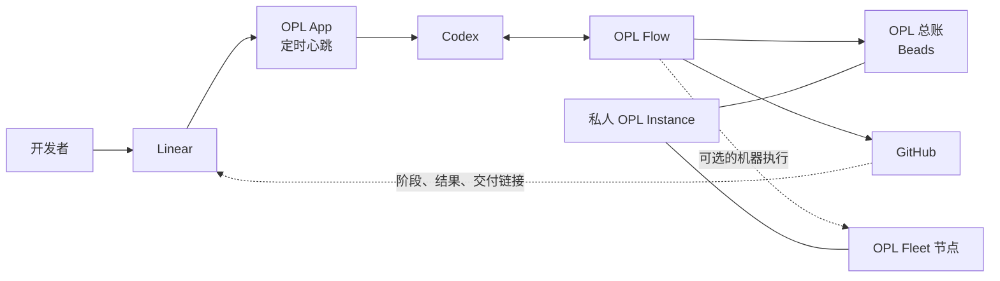

<p align="center">
  
</p>

<p align="center">
  <a href="./README.md">English</a> | <a href="./README.zh-CN.md"><strong>中文</strong></a>
</p>

<h1 align="center">OPL Flow</h1>

<p align="center"><strong>面向 AI 开发舰队的工作流与协作层</strong></p>
<p align="center">从一台 Codex 到多任务、多仓库、多机器，让工作始终围绕同一份可靠状态继续推进</p>

<p align="center">
  
</p>

## OPL Flow 是什么

Codex 已经能够推理、编程、调用工具并协调多个 Agent。真正容易失控的，通常
不是某一次编码，而是工作跨越多个任务、仓库、对话和机器之后：谁在负责，进展
写到了哪里，哪个结果已经进入主线，下一步应由谁继续。

OPL Flow 解决的是这层连续性问题。它不会替代 Codex 的原生智能，也不会再造
一套 Agent 调度器，而是把以下能力组织在同一个公开产品中：

- 一份精简、可安全合并的用户级工作配置；
- 面向日常开发和并发协作的核心 Skill；
- 以 Beads 为底层的持久 OPL 总账；
- 可选的 Linear 人类门户；
- 可选的多机 Fleet 引擎；
- 并行 Git 工作的恢复、合并与清理工具。

一句话概括：

> **Codex 负责执行，OPL Flow 负责让工作持续有序；OPL 总账保存任务真相，
> Linear 方便人查看和录入，OPL Fleet 提供实际干活的机器。**

## 各模块如何协作



| 模块 | 负责什么 | 不负责什么 |
| --- | --- | --- |
| **Codex** | 推理、工具调用、实现和原生多 Agent 协作 | 持久保存跨对话任务状态 |
| **OPL Flow** | 用户配置、核心 Skill、总账接入、并发协作和通用 Fleet 引擎 | 代替模型思考或决定领域真相 |
| **OPL 总账** | 以 Beads/Dolt 保存目标、依赖、负责人、检查点和剩余工作 | 唤醒 Codex 或分发 Agent |
| **GitHub** | 保存分支、PR、CI、合并和发布证据 | 成为任务总账或机器调度器 |
| **Linear** | 面向人的任务录入、优先级和进度门户，并展示 Codex/GitHub 的窄回写 | 成为第二套总账或执行调度器 |
| **OPL Fleet** | 节点检查、任务准入、仓库更新和可选分发 | 在机器之间复制凭据、会话或软件文件 |
| **OPL Instance** | 某个个人或组织的私人总账、机器、策略、资产和个性化配置 | 承载通用公开产品代码 |

这些模块可以逐层启用。Linear、Fleet 或私人 Instance 未配置时，OPL Flow 的
核心工作流仍然可以独立使用。

## 核心 Skill 与增强包

OPL Flow 和 OPL Skills 不是两套相互竞争的工作流，而是“核心产品 + 可选增强”
的关系。

### OPL Flow 内置 Skill

当前 `0.1.30` 随插件安装五个核心 Skill：

- `opl-flow`：创建总账 Dashboard、安装、更新、状态检查，以及 Linear 和 Fleet 入口；
- `coordinate-concurrent-tasks`：多任务、多对话和多 worktree 的并发协调；
- `develop-and-deliver`：系统化开发、验证与交付；
- `task-mode-gate`：真实发布、部署、迁移和破坏性写入边界；
- `recover-codex-tasks`：基于证据恢复中断或缺失的 Codex 任务。

### OPL Skills 可选增强包

公开仓库 [`gaofeng21cn/opl-skills`](https://github.com/gaofeng21cn/opl-skills)
保存可以脱离 OPL Flow 独立使用的增强能力，例如架构简化、生产可靠性、学习和
文档工作流。它按自己的节奏更新，不与 OPL Flow 绑定版本。

`architect-and-simplify` 继续作为可选增强：已安装时按任务意图路由，未安装时由
Codex 直接完成同类架构判断，不阻断任务。升级时，Framework 只有在 Skills CLI lock
精确证明旧目录来自 `gaofeng21cn/opl-skills` 及对应路径时，才移出三个旧核心 Skill
投影；无锁、来源不同或格式异常都会保留并报告冲突，不按同名目录删除。

两者的联动方式很简单：

1. OPL Flow 插件提供核心工作流；
2. 用户需要增强能力时，从 OPL Skills 官方仓安装；
3. Codex 在新会话中发现这些 Skill，并按任务语义自动选用；
4. 私人 OPL Instance 可以记录个人选择的增强清单；
5. Fleet 只检查各节点是否具备这些能力，实际安装和升级仍由每个来源自行完成。

OPL Flow 不会在运行时复制 OPL Skills 的源码，也不会把整套增强包变成核心依赖。

安装全部公开增强能力：

```bash
npx skills add gaofeng21cn/opl-skills -g -a codex -s '*' -y --full-depth
```

也可以让 Codex 一次完成核心与增强配置：

```text
使用 $opl-flow setup 初始化我的开发工作流，并安装 OPL Skills 公开增强包。
```

第一次建立总账与监督任务时，直接说：

```text
使用 $opl-flow start 创建或复用我的 OPL 总账 Dashboard，并每小时监督。
```

该动作幂等复用或创建一个本机 Dashboard 任务、一个以
`codex://thread/<thread_id>` 关联的 Bead，以及一个原生每小时 Heartbeat，并以
任务、Bead、Automation 和 Dolt 的 fresh readback 收尾；重复执行不会创建第二套循环。

私人 Skill 放在各自的 OPL Instance 中，不进入公开增强包。

## OPL 总账、Linear 与自动接单

### OPL 总账

OPL Flow 不自建任务数据库。它通过官方 `bd` 命令使用 Beads：

- Beads 保存任务、依赖、认领、到期时间和检查点；
- Dolt 负责跨机器同步总账数据；
- OPL Flow 负责安全初始化、周期事项对账和状态检查；
- Codex 负责创建任务、判断、执行和原生多 Agent 协作；
- Codex Automation、定时任务或持续集成负责按时唤醒，Beads 本身不负责唤醒。

这样即使更换对话或机器，也可以从总账继续，而不必依赖一段越来越长的聊天记录。

### Linear 门户与 Codex 接单

Linear 是可选的人类入口；本机默认路径是 OPL App 定时心跳消费带有
`codex-ready` 且未设置云端委派的任务，并交给本机 Codex/OPL Flow。Linear 的
ChatGPT Codex 或云端委派不是默认入口，Beads 也不参与 Linear 与 Codex 之间的
日常全量镜像。数据流是：

```text
人在 Linear 创建任务并标记为 codex-ready
  -> 本机 OPL App 定时心跳读取并准入未设置云端委派的任务
  -> 本机 Codex/OPL Flow 接单
  -> Codex 在 OPL Flow 下创建或关联 Bead
  -> Codex 按 Beads 依赖、负责人和检查点执行
  -> GitHub 保存分支、PR、CI 和交付证据
  -> Codex/OPL Flow 向 Linear 窄回写阶段、阻断、结果和链接
```

为了避免把所有想法都自动交给 Agent，推荐只自动接收带有 `codex-ready` 标签的
任务。Beads 的 Linear adapter 只用于迁移、恢复和审计，不作为日常同步链路；Beads
仍是 Agent 内部的任务总账，GitHub 是代码和交付证据的权威来源。若使用其他
Codex 接入方式，也应保持同样的“创建/关联 Bead、写 GitHub、窄回写 Linear”边界。

## 从一台机器开始

从公开仓安装 OPL Flow 插件：

```bash
codex plugin marketplace add gaofeng21cn/opl-flow
codex plugin add opl-flow@opl-flow-local
```

启动新的 Codex 会话，然后输入：

```text
使用 $opl-flow setup 初始化我的可复用开发工作流。
```

更新现有安装：

```text
使用 $opl-flow update，从各组件的官方来源更新，并验证实际生效状态。
```

Skill 会完成能够自动完成的步骤，只在 GitHub、Linear 等外部服务必须授权时请求
用户操作。基础安装不要求 Linear 或 Fleet。

## 按需要选择规模

| 方案 | 组成 | 适合场景 |
| --- | --- | --- |
| **基础工作流** | Codex + OPL Flow | 一个人、一台机器的日常开发 |
| **增强工作流** | 基础工作流 + OPL Skills | 需要架构、交付和专项工作能力 |
| **持久工作流** | 基础或增强工作流 + 私人 OPL Instance + Beads | 长周期开发和多个活跃任务 |
| **可视工作流** | 持久工作流 + Linear | 需要面向人的任务入口和进度门户 |
| **舰队工作流** | 持久工作流 + 已登记节点 | 多机开发、测试和计算任务 |

增加上层能力不会改变下层的权威边界；删除任何可选层后，基础工作流仍然可用。

## 多机 Fleet 的原则

OPL Flow 提供通用 Fleet 引擎，私人 OPL Instance 保存节点名称、能力、调度策略、
执行节点绑定和脱敏回执。

- 每台机器从软件和 Skill 的官方来源自行安装、升级；
- 版本尽量更新到各平台最新兼容版本，而不是照抄主控机器的旧版本；
- 主控只分发期望状态和任务，不复制二进制文件、缓存或凭据；
- 机器离线属于正常状态，下次上线时再对账；
- 分发前使用实时检查判断电源、负载、磁盘、占用和任务所需能力；
- 仓库只做安全的快进更新，脏分支、分叉分支和任务分支留给原任务处理。

## 公开与私人边界

**公开 OPL Flow 包含：**

- 用户配置源码和核心 Skill；
- 不含凭据的 Beads、Linear 接入逻辑；
- 通用 Fleet 引擎和数据结构；
- Git/worktree 生命周期与验证工具；
- 安装、更新、状态检查和公开文档。

**私人 OPL Instance 包含：**

- Beads/Dolt 总账数据；
- 机器清单、SSH 路由、执行节点绑定和分发策略；
- 私人 Skill、仓库治理、部署说明、域名和资产记录；
- 脱敏回执与个人补充配置。

凭据、会话、对话历史、日志、缓存、机器私有路径和 Fleet 租约密钥不进入公开仓库，
也不在节点之间复制。

## OPL 产品关系

| 产品 | 定位 |
| --- | --- |
| **OPL Flow** | AI 开发舰队的工作流与协作层 |
| **OPL Framework** | 运行时、Package 生命周期、合同和 Agent 执行底座 |
| **One Person Lab App** | 面向用户的工作台，也是可选的 Flow 安装载体 |
| **OPL Skills** | 可独立安装的公开增强能力 |
| **OPL Instance** | 某个个人或组织的私人运行配置与状态 |

OPL Flow 在技术上仍是 `OPL Package(kind=workflow_profile)`，但它已经不只是一份
用户配置文件，而是把总账、并发协作和多机执行的通用运行方式一起产品化。

## 开发者命令

<details>
<summary><strong>展开机器可读入口</strong></summary>

```bash
# 综合状态
python3 scripts/opl_workflow.py status --instance <opl-instance>

# 用户配置
python3 scripts/opl_workflow.py profile status
python3 scripts/opl_workflow.py profile prepare

# 总账
python3 scripts/opl_workflow.py ledger init --instance <opl-instance>
python3 scripts/opl_workflow.py ledger reconcile-operations --instance <opl-instance>
(cd <opl-instance> && bd ready --json)
(cd <opl-instance> && bd dolt pull)
(cd <opl-instance> && bd dolt push)

# Linear 迁移/审计 adapter（非日常接单链路）
(cd <opl-instance> && bd linear status --json)
(cd <opl-instance> && bd linear sync --dry-run --json)

# 可选 Fleet
python3 scripts/opl_workflow.py fleet --instance <opl-instance> status
python3 scripts/opl_workflow.py fleet --instance <opl-instance> repos status

# 源码验证
scripts/verify.sh
scripts/verify.sh full
```

旧 `codex-fleet` 命令仅用于已有私人安装的过渡兼容；通用 Fleet 源码由 OPL Flow
维护。

</details>

## 进一步阅读

- [可复用开发工作流架构](docs/reusable-workflow-architecture.md)
- [能力组合与维护边界](docs/capability-governance.md)
- [新机器安装](docs/new-machine-codex-setup.md)
- [当前实现状态](docs/status.md)
- [文档索引](docs/README.md)

## 许可证

[MIT](LICENSE)
