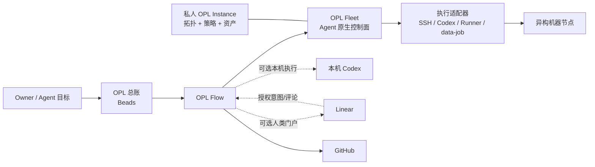

<p align="center">
  
</p>

<p align="center">
  <a href="./README.md">English</a> | <a href="./README.zh-CN.md"><strong>中文</strong></a>
</p>

<h1 align="center">OPL Flow</h1>

<p align="center"><strong>Codex 基线与持久工作协同层</strong></p>
<p align="center">先保证一台 Codex 的使用下限，再把持久工作真相连接到 OPL Fleet 的 Agent 原生分布式执行与连续性系统</p>

<p align="center">
  
</p>

## OPL Flow 是什么

Codex 已经能够推理、编程、调用工具并协调多个 Agent。OPL Flow 解决两个模型
原生能力之外的产品问题：第一，给单台 Codex 建立稳定的使用下限，包括精简的
`AGENTS.md`、模型与推理强度建议、明确的上下文边界，以及推荐的检索、Office、
文档提取和 UI 能力；第二，在工作跨越多个任务、仓库、对话和机器后持续保存责任、
进度和真实终态。

它不会替代 Codex 的原生智能，也不会再造一套 Agent 调度器，而是把以下能力组织
在同一个公开产品中：

- 一份精简、可安全合并的用户级工作配置与模型建议；
- 一套可诊断、可修复但不阻断 Flow 的推荐体验能力基线；
- 面向日常开发和并发协作的核心 Skill；
- 以 Beads 为底层的持久 OPL 总账；
- 可选的 Linear 人类门户；
- 可选的 Agent 原生分布式执行与任务连续性 Fleet 控制面；
- 并行 Git 工作的恢复、合并与清理工具。

一句话概括：

> **Codex 与 worker Agent 负责执行，OPL Flow 负责保证 Codex 使用下限并基于持久真相
> 协调工作；OPL 总账是当前 owner/Instance 的完整人类工作总账，OPL Fleet 是 Agent
> 原生的分布式执行与连续性控制系统，Linear 和 GitHub 分别作为可选的人类门户与交付权威。**

`OPL Ledger` 指总账本身，不是监督器，也不限于 OPL 源码开发。一个本机、每小时运行的
`OPL Flow Supervisor` 可以监督一个或多个已登记 Linear Projects。

Flow 自身仍是可选 Package。没有 Flow 不得阻断 OPL App、OPL Base、普通 Codex、
其他 Package 或领域工作；推荐体验能力缺失只产生 `degraded` 与修复入口，不得把
Flow 本身判为不可用。

## 各模块如何协作



| 模块 | 负责什么 | 不负责什么 |
| --- | --- | --- |
| **Codex** | 推理、工具调用、实现和原生多 Agent 协作 | 持久保存跨对话任务状态 |
| **OPL Flow** | 用户配置与模型建议、体验能力意图、核心 Skill、总账接入、并发协作和通用 Fleet 引擎 | 代替模型思考、维护 App UI 状态或决定领域真相 |
| **OPL 总账** | 当前 owner/Instance 的完整人类工作总账；以 Beads/Dolt 保存目标、依赖、负责人、检查点和剩余工作 | 唤醒 Codex 或分发 Agent |
| **OPL Flow Supervisor** | 用唯一每小时 Heartbeat 监督全部已登记 Linear Projects、Dashboard 工作与总账对账 | 取代总账或创建多个并行监督循环 |
| **GitHub** | 保存分支、PR、CI、合并和发布证据 | 成为任务总账或机器调度器 |
| **Linear** | 以一个或多个已登记 Project 完整展示所有用户总账任务，但仅保留意图、层级、优先级、到期、状态、简短阻断/结果和链接 | 成为第二套总账或执行调度器 |
| **OPL Fleet** | 基于节点、workspace、owner 与容量 fresh evidence 的 Agent 原生分布式执行与连续性控制系统，以及只读 Ambient Ops 可观测性扩展 | 另建任务真相源，或在机器之间复制凭据、会话和软件文件 |
| **OPL Instance** | 某个个人或组织的私人总账、机器、策略、资产和个性化配置 | 承载通用公开产品代码 |

这些模块可以逐层启用。Linear、Fleet 或私人 Instance 未配置时，OPL Flow 的
核心工作流仍然可以独立使用。

## 三个独立状态平面

- `package_operational`：Flow 自身是否安装、启用并可调用；只有这里失败才阻断
  Flow 专属动作。
- `experience_baseline`：Agent Reach、OfficeCLI、MinerU、UI/UX 等推荐体验能力；
  缺失时为 `degraded` 并提供 owner-supported repair，但 Flow 仍可用。
- `specialized_capabilities`：架构等可选增强；缺失是正常状态，不要求 repair。

默认能力的权威链只有一条：

```text
Flow policy -> Framework compiler -> materialization/status/build lock -> App
```

因此 App 首次运行的 `recommended_skills` 来自已安装 Flow strategy 的 Framework
投影，不再维护静态清单。Agent Reach 由 Flow baseline 进入推荐安装和健康检查；缺失
时只让 internet-research bundle 与 `experience_baseline` 降级，不会禁用 Flow、总账或
核心 Skill。

Flow 推荐 `gpt-5.6-sol + max`。显式用户选择优先；OPL App 继续拥有 Auto 算法、
模型控件、持久化和 Flow 缺席时的 fallback。Flow 不注入隐藏 prompt，也不会把
实时 Codex catalog 中不存在的模型说成可用。

## 核心 Skill 与增强包

OPL Flow 和 OPL Skills 不是两套相互竞争的工作流，而是“核心产品 + 可选增强”
的关系。

### OPL Flow 内置 Skill

当前 `0.1.49` 随插件安装九个核心 Skill：

- `opl-flow`：渐进加载的主入口，固定路由
  `doctor/setup/tune/update/release-package/start/fleet`；
- `coordinate-concurrent-tasks`：多任务、多对话和多 worktree 的并发协调；
- `codex-app-owner-migration`：通过 Codex App 原生可见任务迁移执行 owner，要求完整
  workspace 准入、目标任务 readback，并在迁移失败时保持本机 owner 继续执行；
- `develop-and-deliver`：系统化开发、验证与交付；
- `github-ssot-patrol`：基于最新 SSOT 的 GitHub CI、open PR 与 open issue
  巡检，提供确定性的只读快照与收口；
- `opl-doc`：以 live repo truth 为依据做开发文档语义治理，不强制固定目录，也不建立
  第二套工作总账；
- `opl-fleet`：私人 Instance 支撑的 Agent 原生多机 workspace currentness、节点准入、
  受保护执行、任务连续性和分发；
- `task-mode-gate`：真实发布、部署、迁移和破坏性写入边界；
- `recover-codex-tasks`：基于证据恢复中断或缺失的 Codex 任务。

### OPL Skills 可选增强包

公开仓库 [`gaofeng21cn/opl-skills`](https://github.com/gaofeng21cn/opl-skills)
保存可以脱离 OPL Flow 独立使用的增强能力，例如架构简化、生产可靠性、学习和
文档工作流。它按自己的节奏更新，不与 OPL Flow 绑定版本。

`architect-and-simplify` 继续作为可选增强：已安装时按任务意图路由，未安装时由
Codex 直接完成同类架构判断，不阻断任务。升级时，Framework 只有在 Skills CLI lock
精确证明旧目录来自 `gaofeng21cn/opl-skills` 及对应路径时，才移出三个旧核心 Skill
投影；无锁、来源不同或格式异常都会保留并报告冲突，不按同名目录删除。

两者的联动方式很简单：

1. OPL Flow 插件提供核心工作流；
2. 用户需要增强能力时，从 OPL Skills 官方仓安装；
3. Codex 在新会话中发现这些 Skill，并按任务语义自动选用；
4. 私人 OPL Instance 可以记录个人选择的增强清单；
5. Fleet 只检查各节点是否具备这些能力，实际安装和升级仍由每个来源自行完成。

OPL Flow 不会在运行时复制 OPL Skills 的源码，也不会把整套增强包变成核心依赖。

OPL Skills 的浏览分类与安装 preset 分离。`development` 方法和六个
`architecture-lenses` 本质上都属于开发增强，因此 Flow 不会把任一单独分类当成
默认增强集合，也不使用 wildcard 安装。具名 `development-complete` preset 会精确
解析为五个开发/架构方法 Skill：
`architect-and-simplify`、`zoom-out`、`improve-codebase-architecture`、
`grill-with-docs`、`prototype`，以及六个 `book-*` 架构 lens。安装时由 Flow 将这些
明确 ID 交给 OPL Skills 的 owner-supported route。

也可以让 Codex 一次完成核心与增强配置：

```text
使用 $opl-flow setup 初始化我的开发工作流，并安装 OPL Skills 公开增强包。
```

第一次建立总账与监督任务时，直接说：

```text
使用 $opl-flow start 创建或复用我的 OPL 总账 Dashboard，并每小时监督。
```

该动作幂等复用或创建一个本机 Dashboard 任务、一个以
`codex://thread/<thread_id>` 关联的 Bead，以及唯一原生每小时
`OPL Flow Supervisor` Heartbeat；默认登记 `OPL Ledger`，同时通过官方 Linear
Connector 把每个用户总账 Bead 投影为唯一 Linear issue，保留层级并限制字段集合，
最后从 owner API fresh 回读任务、Bead、Automation、Linear 和 Dolt。同一 Supervisor
以后可以增加更多已登记 Project；重复执行不会创建第二套循环、Dashboard Bead 或 issue。

之后每次 Heartbeat 调用 `$opl-flow supervise`。Automation 只保存私人 Instance、
Dashboard、已登记 Project、授权账号、频率和通知参数；可复用监督规则由版本化 Skill
统一持有。`ledger supervisor-snapshot` 压缩动态 Beads/Dolt/Git 证据，并校验
execution mode、remaining 数组和 Linear 映射唯一性，不把完整 notes 或 checkpoint
复制进提示词。

私人 Skill 放在各自的 OPL Instance 中，不进入公开增强包。

## OPL 总账、Linear 与自动接单

### OPL 总账

OPL Flow 不自建任务数据库。它通过官方 `bd` 命令使用 Beads：

- Beads 保存任务、依赖、认领、到期时间和检查点；
- Dolt 负责跨机器同步总账数据；
- OPL Flow 负责安全初始化、周期事项对账和状态检查；
- Codex 负责创建任务、判断、执行和原生多 Agent 协作；
- Codex Automation、定时任务或持续集成负责按时唤醒，Beads 本身不负责唤醒。

这样即使更换对话或机器，也可以从总账继续，而不必依赖一段越来越长的聊天记录。

### Linear 门户与 Codex 接单

Linear 是用户总账的完整人读投影：每个用户总账 Bead 都必须有且只有一个 Linear
issue，并保留父子层级；“窄”指字段集合，不是覆盖率。Codex 通过官方 Linear
Connector 维护这份投影。已登记 Project 默认由本机 Codex 管理；Codex Cloud delegate
与这条路由冲突并 fail closed。数据流是：

```text
人从 Linear 写入意图、优先级、到期、可选的 codex-paused 或取消
  -> Codex/OPL Flow 幂等创建或关联唯一 Bead/Linear issue
  -> Codex 按 Beads 依赖、负责人和检查点执行
  -> Beads 向 Linear 投影执行状态、简短阻断和结果
  -> GitHub 提供分支、PR、CI、合并、发布和交付链接
```

`codex-paused` 是唯一显式 dispatch 暂停信号，并且只阻止 dispatch；该 issue 的
Linear 对账和授权用户评论摄入仍继续。监督器通过官方
`linear_list_comments`，按每个 Project 保存 Linear comment-ID 水位，以 comment ID
作为幂等键，把每条新授权用户评论恰好一次送入对应本机 Codex task。每小时无变化
快路径只调用一次 `list_threads`，把 live executor 按最多 8 个一组交给零等待
`wait_threads`，并只读取水位后发生变化的 Linear issue；未变化任务不做精确
`read_thread`，未变化 issue 不读取 comments，Blocked/Monitoring 直接复用
`next_review_at` 退避而不是每小时复核 owner。完整巡检只在较低频率或 cursor、schema、
timeout、用户明确要求等触发条件下执行。监督器忽略 Supervisor、Agent 和 Automation
自身评论以防回环，并最迟在下一次 Heartbeat 处理。

任务生命周期与当前执行方式分开管理。Beads 保存 `open`、`in_progress`、
`blocked`、`deferred`、`closed`、`pinned`；OPL Flow 另记录 `active`、
`waiting_user`、`waiting_external`、`monitoring`、`on_demand` 或 `aggregate`。
Linear 据此显示 `Todo`、`In Progress`、`Needs Action`、`Blocked`、
`Monitoring`、`On Demand`、`Backlog` 或 `Done`。
`Needs Action` 表示下一步需要用户登录、决策或授权；`Blocked` 表示外部事件或上游依赖阻止
继续推进，两者都不表示仍有 Agent 占用执行资源。回读时，两者保留 Beads 原有的 `blocked`，
否则保持 `in_progress`；`Monitoring` 归一化为 `in_progress`。只有当前确实在执行或存在活跃
后代的任务才显示 `In Progress`。

`Monitoring` 是总账中的长期责任，不要求保留一个空闲 Codex 对话。`On Demand` 是
“长期保留但当前没有动作”的明确记录态：Bead 使用 `pinned`，Linear 使用 `On Demand`，
不绑定 execution thread，也不启动常驻监控；只有用户新指令或明确事件才恢复为
`In Progress`。只有真正的工作台或
Supervisor 才保持长期可用；周期或事件驱动任务在每轮有限执行完成后清空 live
`execution_thread`，把已完成对话仅作为 provenance 保存，并只在到期或触发事件发生时绑定
新的有限 executor。整个过程中 Bead 与 Linear issue 始终是稳定身份。

Linear 不接收凭据、本机路径、日志、完整 notes、内部 metadata 或 checkpoints；
Beads/Dolt 仍是执行总账，GitHub 仍是代码和交付证据的权威来源。日常 onboarding
和对账不使用或要求 `bd linear sync`。

## 从一台机器开始

从公开仓安装 OPL Flow 插件：

```bash
codex plugin marketplace add gaofeng21cn/opl-flow
codex plugin add opl-flow@opl-flow-local
```

安装只部署能力，不会创建 Dashboard、Bead、Linear Project 或 Automation。只有显式
执行 `$opl-flow start` 才进行正式 onboarding：

```text
使用 $opl-flow start 正式接入我的完整 OPL 总账，并由 OPL Flow Supervisor 每小时监督。
```

启动新的 Codex 会话，然后输入：

```text
使用 $opl-flow setup 初始化我的可复用开发工作流。
```

只读检查或定向优化时可以说：

```text
使用 $opl-flow doctor 检查我的实际 Codex 使用基线。
使用 $opl-flow tune 优化我的 AGENTS.md 和模型设置。
```

更新现有安装：

```text
使用 $opl-flow update，从各组件的官方来源更新，并验证实际生效状态。
```

Skill 会完成能够自动完成的步骤，只在 GitHub、Linear 等外部服务必须授权时请求
用户操作。基础安装不要求 Linear 或 Fleet，也不表示 `$opl-flow start` 已执行。

## 按需要选择规模

| 方案 | 组成 | 适合场景 |
| --- | --- | --- |
| **基础工作流** | Codex + OPL Flow Profile、模型策略、基线投影和核心 Skill | 一个人、一台机器的日常开发 |
| **增强工作流** | 基础工作流 + OPL Skills | 需要架构、交付和专项工作能力 |
| **持久工作流** | 基础或增强工作流 + 私人 OPL Instance + Beads | 长周期开发和多个活跃任务 |
| **可视工作流** | 持久工作流 + Linear | 需要面向人的任务入口和进度门户 |
| **舰队工作流** | 持久工作流 + 已登记节点 | 多机开发、测试和计算任务 |

增加上层能力不会改变下层的权威边界；删除任何可选层后，基础工作流仍然可用。

## 多机 Fleet 的原则

OPL Fleet 是开放通用的 Agent 原生分布式执行与连续性控制面，当前首先服务个人或
小团队的异构设备。可以用一个简化的时代框架理解：HPC 时代以 Slurm 类系统管理作业
和算力，云计算时代以 Kubernetes 类系统编排容器与期望状态，Agent 时代则需要统一
管理 Agent 的身份、状态、上下文边界、权限、预算、动态任务图和生命周期。

这并不否定已经存在的 Agent 框架、耐久工作流、分布式执行引擎和托管运行时，而是指出
这些能力仍然分散，尚未形成被广泛采用的开放通用 Agent 原生控制平面。Fleet 不替代
Slurm、Kubernetes、Ray、云批处理、CI 或工作流引擎；它们继续作为命令、容器、作业或
DAG 的执行后端。Fleet 补齐 Agent 任务跨机器所需的稳定 objective、唯一 execution
owner、可复现 Agent/workspace 基线、受限权限与预算、checkpoint、未知结果恢复和任务级
终态证据。

“Agent 管 Agent”指控制 Agent 把人类自然语言意图变成 Ledger 持有的动态任务图，并监督
worker Agent；Fleet 的确定性合同继续守住身份、权限、预算、租约和生命周期，不代表无约束
自治。完整定位与目标边界见
[Fleet 架构 SSOT](docs/opl-fleet-architecture.md)。

OPL Flow 提供通用 Fleet 引擎，私人 OPL Instance 保存节点名称、能力、调度策略、
workspace profile、执行节点绑定和脱敏回执。

- 每台机器从软件和 Skill 的官方来源自行安装、升级；
- 版本尽量更新到各平台最新兼容版本，而不是照抄主控机器的旧版本；
- 主控只分发期望状态和任务，不复制二进制文件、缓存或凭据；
- 机器离线属于正常状态，下次上线时再对账；
- 分发前使用实时检查判断电源、负载、磁盘、占用和任务所需能力；
- 仓库只做安全的快进更新，脏分支、分叉分支和任务分支留给原任务处理。

Flow 通过一套统一的分发契约连接任务和机器，不再建立第二套任务数据库，也不重写
已有执行调度系统：

```text
任务资源需求 -> 分发规划 -> 实时 doctor -> 租约 CAS
  -> 执行适配器 -> 结果回读 -> 释放租约
```

对应命令为：

```bash
python3 scripts/opl_fleet.py --instance <opl-instance> dispatch plan \
  --requirements-json @execution-requirements.json
python3 scripts/opl_fleet.py --instance <opl-instance> dispatch acquire \
  --requirements-json @execution-requirements.json \
  --owner-task <task-id> --owner-thread <thread-id> --owner-run <run-id>
python3 scripts/opl_fleet.py --instance <opl-instance> dispatch verify <dispatch-id>
python3 scripts/opl_fleet.py --instance <opl-instance> dispatch execute <dispatch-id> \
  --owner-task <task-id> --owner-thread <thread-id> --owner-run <run-id> \
  --argv-json '["command", "argument"]'
python3 scripts/opl_fleet.py --instance <opl-instance> dispatch release <dispatch-id> \
  --owner-task <task-id>
```

`plan` 只是候选节点回读；只有 `acquire` 才会执行实时 `doctor`、检查能力、电源、
磁盘、温度和交互占用，并取得控制器租约。机器关机或暂时不可达时会被跳过；没有
合格节点就返回 `unavailable`，不把正常离线误报为系统故障。

适配器边界保持明确：

- `local-codex`：当前 Codex 会话直接执行，不申请 Fleet 租约；
- `lease-only`：只预留远端容量，由调用方负责实际执行；
- `github-runner`：复用现有 Runner 启停事务，但不会代替 GitHub 提交任务；
- `ssh-session`：验证租约后，通过私人 Instance 的 SSH 路由执行一组结构化参数；
  Windows 节点固定在 WSL 内执行；
- `remote-codex`：仍是规划中的适配器，尚未实现时直接失败。

租约、Runner 在线或分发规划都不等于任务已经执行；必须有执行适配器自己的结果
回读，才能把任务记为实际完成。

需要 Fleet 的任务在 Beads 的 `metadata.opl_execution_requirements` 中保存一份资源意图，
并由 `contracts/execution-requirements.schema.json` 校验。它可以声明执行适配器、平台能力、
内存、CUDA 或 Metal、最低显存、显卡型号、优先级、是否可抢占和租约时长。Fleet 只把
这些条件与实时库存匹配，不在总账里固定偏好机器，也不建立第二套任务数据库。

任务的稳定 identity 和当前 execution owner 始终由 Beads/Dolt 持有；GitHub 持有代码
currentness、可恢复 checkpoint 和交付证据；Codex task/thread 只是可替换的 executor
handle。因此跨机迁移不要求物理搬运原对话，而是源端冻结写入并发布 checkpoint，目标端
fresh 验证 workspace/Git 后以 CAS 认领同一个 objective，再由新对话继续执行。
声明式 workspace bootstrap/currentness 与 execution-owner migration 正在独立源码 lane
实现；在 contracts、source、tests、canonical integration 和真实跨机回读闭合前，仍是
目标能力，不是已交付的当前行为。

### 动态加载，而不是全部预加载

`opl-flow` 是稳定的主路由 Skill，但不是把所有能力一次性装入当前上下文：

1. 所有 OPL 工作流请求先进入 `opl-flow`；
2. 安装 OPL Flow 时，内置专业 Skill 会一起变得可发现；主 Skill 再根据任务语义按需
   调用并发协调、开发交付、Fleet、门禁或恢复，不会让每个任务都加载全部说明；
3. 只有任务需要时，才调用已经安装的可选专业 Skill；未安装时由 Codex 直接完成同类
   判断，不因为可选增强缺失而阻断；
4. 只有任务确实需要跨机执行或迁移、远端平台、GPU、虚拟机、图形界面或批量容量时，
   才启用 Fleet。

Skill 的安装和升级仍由各自来源负责。安装或升级后如果需要刷新发现结果，重新开启
一个 Codex 会话；不要把主控机的 Skill 文件复制到其他节点。这样同一套 OPL Flow 可以
服务单机用户，也可以按需扩展为个人 AI 舰队。

## 公开与私人边界

**公开 OPL Flow 包含：**

- 用户配置源码和核心 Skill；
- 不含凭据的 Beads、Linear 接入逻辑；
- 通用 Fleet 引擎和数据结构；
- Git/worktree 生命周期与验证工具；
- 安装、更新、状态检查和公开文档。

**私人 OPL Instance 包含：**

- Beads/Dolt 总账数据；
- 机器清单、SSH 路由、执行节点绑定和分发策略；
- 私人 Skill、仓库治理、部署说明、域名和资产记录；
- 脱敏回执与个人补充配置。

凭据、会话、对话历史、日志、缓存、机器私有路径和 Fleet 租约密钥不进入公开仓库，
也不在节点之间复制。

## OPL 产品关系

| 产品 | 定位 |
| --- | --- |
| **OPL Flow** | Codex 体验基线与工作协同控制层 |
| **OPL Framework** | 运行时、通用 Flow 能力编译/物化、Package 生命周期、合同和 Agent 执行底座 |
| **One Person Lab App** | 面向用户的工作台，也是可选的 Flow 安装载体 |
| **OPL Skills** | 可独立安装的公开增强能力 |
| **OPL Instance** | 某个个人或组织的私人运行配置与状态 |

OPL Flow 在技术上仍是 `OPL Package(kind=workflow_profile)`，但它已经不只是一份
用户配置文件，而是把总账、并发协作和多机执行的通用运行方式一起产品化。

## 开发者命令

<details>
<summary><strong>展开机器可读入口</strong></summary>

```bash
# 综合状态
python3 scripts/opl_workflow.py status --instance <opl-instance>

# 总账
python3 scripts/opl_workflow.py ledger init --instance <opl-instance>
python3 scripts/opl_workflow.py ledger reconcile-operations --instance <opl-instance>
(cd <opl-instance> && bd ready --json)
(cd <opl-instance> && bd dolt pull)
(cd <opl-instance> && bd dolt push)

# Linear 人读投影
# Codex 通过官方 Linear Connector 为每个用户总账 Bead 搜索、读取、保存并回读
# 唯一的窄字段 issue。

# 可选 Fleet
python3 scripts/opl_workflow.py fleet --instance <opl-instance> status
python3 scripts/opl_workflow.py fleet --instance <opl-instance> repos status

# 源码验证
scripts/verify.sh
scripts/verify.sh full
```

旧 `codex-fleet` 命令仅用于已有私人安装的过渡兼容；通用 Fleet 源码由 OPL Flow
维护。

</details>

## 进一步阅读

- [可复用开发工作流架构](docs/reusable-workflow-architecture.md)
- [能力组合与维护边界](docs/capability-governance.md)
- [新机器安装](docs/new-machine-codex-setup.md)
- [文档索引](docs/README.md)

## 许可证

[Apache-2.0](LICENSE)
