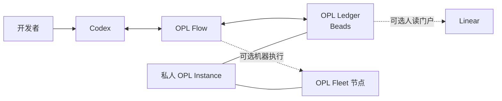

<p align="center">
  
</p>

<p align="center">
  <a href="./README.md">English</a> | <a href="./README.zh-CN.md"><strong>中文</strong></a>
</p>

<h1 align="center">OPL Flow</h1>

<p align="center"><strong>面向 AI 开发舰队的模型原生工作流与协作层</strong></p>
<p align="center">提高一台 Codex 的工作下限，也让多个 Agent、仓库和机器围绕同一份持久真相持续协作</p>

<p align="center">
  
</p>

## 为什么需要 OPL Flow

Codex 已经能够推理、写代码、调用工具并原生协调多个 Agent。真正困难的
部分，往往出现在开发超出一个对话，开始跨越多个任务、仓库和机器之后：

- 当前目标由哪个任务负责，下一项真正可执行的工作是什么？
- 哪项成果已经进入 canonical 仓库，哪项还只在临时分支里？
- 如何在另一台机器继续工作，同时不复制凭据、会话和运行缓存？
- 如何让人方便地查看进度，又不把项目看板变成第二份任务真相？
- 当 Ledger、Linear 或 Fleet 没有启用时，核心工作流能否继续使用？

**OPL Flow 负责提供这种连续性，但不替代 Codex 的原生智能。**
它从一个精简的用户级 Profile 和一组工作流 Skill 开始；项目需要时，再按需
加入基于 Beads 的持久总账、Linear 人读门户和多机 Fleet 引擎。

## 一句话理解

**Codex 负责干活，OPL Flow 负责组织工作如何持续；OPL Ledger 保存任务
真相，Linear 让人方便查看，OPL Fleet 提供实际执行这些工作的机器。**

除执行器本身外，每一层都可以独立选用。个人开发者可以只使用 Profile 和
Skills；一个更完整的个人实验室则可以启用整套能力，而不改变底层的开发模式。

## 从一台 Codex 到 AI 舰队

| 使用规模 | OPL Flow 增加什么 | 什么仍由原生能力或各 owner 负责 |
| --- | --- | --- |
| 一台机器 | 精简用户 Profile、工作偏好和可复用 Skills | Codex 推理、工具、项目文件和仓库规则 |
| 多个活跃任务 | owner、恢复、fresh SSOT 集成和收口约定 | Codex 原生多 Agent 与多对话协作 |
| 长周期开发 | OPL Ledger 初始化与幂等 reconciliation | Beads 负责数据库、依赖图、claim 和 Dolt 同步 |
| 人类查看 | 对接 Beads 官方 Linear 集成 | Linear 是门户，不是任务真相或 Agent 调度器 |
| 多台机器 | Fleet 状态、准入、仓库 currentness 与分发策略 | 各机器从组件官方 owner 安装；私人 Instance 保存拓扑和策略 |

因此，OPL Flow 已经不再只是 OPL App 的一个辅助模块。它仍可作为 App
Official Profile 中的可选默认工作流，同时也成为一个可以独立安装、面向
模型原生多 Agent 和多机开发的公开工作流产品。

## 各模块如何协作



| 模块 | 权威边界 |
| --- | --- |
| **Codex** | 推理、工具使用、实现和原生 Agent 协作 |
| **OPL Flow** | Profile、工作流 Skills、reconciliation、Git/worktree lifecycle 与通用 Fleet 引擎 |
| **OPL Ledger** | 持久任务 SSOT，底层使用 Beads，不自建第二套 OPL 数据库 |
| **Linear** | 通过 Beads 官方集成提供可选的人类可读视图 |
| **OPL Fleet** | 基于 fresh 节点证据完成可选的机器准入和执行 |
| **OPL Instance** | 私人总账数据、机器拓扑、策略、资产和个性化 overlay |

Flow 不会变成中央规划器，也不负责领域真相、质量结论、发布验收或规定模型
下一步必须怎么思考。Beads 不会唤醒 Codex，Linear 不会分发 Agent，Fleet
也不会在机器之间复制私人会话或工具二进制文件。

## 核心能力

### 模型原生 Profile

用户 Profile 在不安装僵硬方法论的前提下提高开发下限。它只保留沟通偏好、
source-first 诊断、关键路径、动态并发和工具路由等稳定规则。

### 持久 OPL Ledger

OPL Flow 提供安全初始化、状态读取和 Operations Registry reconciliation。
普通账本操作直接使用 owner 提供的 `bd` CLI；Beads 始终是存储和同步权威。

### 可选 Linear 人读门户

Flow 可以发现并回读 Beads 官方 Linear 连接。同步从 Beads owner 的 dry-run
开始，API Key 不写入 Flow、Git 或任务文本。Linear 是 Ledger 的人读入口，
不是并行总账。

### 可选 OPL Fleet

通用 Fleet 引擎位于本公开仓库。私人 OPL Instance 提供节点 ID、能力、调度
策略、runner binding 和脱敏回执。各节点从每个组件的官方 owner channel
自行更新，不复制主控机器的字节，也不锁定主控机器的旧版本。

### Git 与 Worktree 连续性

Flow 提供 lifecycle 和 absorption 工具，让并行 Git 工作可恢复、可集成、可
清理。不同 worktree 即使 write set 重叠也可以继续开发；冲突在 fresh
canonical 集成时处理。worktree 或 PR 本身永远不等于最终 SSOT。

### 动态弹性组合

OPL Package 和能力可以独立更新。普通依赖只要求稳定身份存在且可调用，不
要求全生态共用一个版本锁。精确 commit 和 digest 只用于证明某一次不可变
发布候选，不能升级为长期运行时耦合。

## 用一条 Codex 指令开始

从公开仓安装 OPL Flow Plugin：

```bash
codex plugin marketplace add gaofeng21cn/opl-flow
codex plugin add opl-flow@opl-flow-local
```

启动一个新的 Codex 对话或 CLI session，然后输入：

```text
使用 $opl-flow setup 初始化我的可复用开发工作流。
```

已有安装需要更新时：

```text
使用 $opl-flow update，从各组件官方 owner 更新并验证实际生效的工作流。
```

Skill 会端到端完成该动作，只在外部授权不可避免时询问用户。Core setup
不要求配置 Linear 或 Fleet。

## 按需要选择部署规模

| 部署方式 | 组件 | 适合场景 |
| --- | --- | --- |
| **Core** | Codex + OPL Flow Profile 和 Skills | 一个人、一台机器的日常开发 |
| **Durable** | Core + 私人 OPL Instance + Beads | 长周期开发和多个活跃任务 |
| **Visible** | Durable + Linear | 需要一个方便查看的项目与运维门户 |
| **Fleet** | Durable + 已登记机器 | 多机开发、测试和计算任务 |

增加上层能力不会改变下层 owner；删除任何可选层后，Core 仍然可用。

## 公开与私人边界

可复用引擎属于 OPL Flow，个人状态不属于。

**公开 OPL Flow 源码包括：**

- Profile 源码和工作流 Skills；
- 不含凭据的 Beads、Linear adapter；
- 通用 Fleet 引擎与 schema；
- Git/worktree lifecycle 和验证工具；
- setup、update、status 与公开文档。

**私人 OPL Instance 包括：**

- Beads/Dolt 任务数据；
- 机器清单、SSH route、runner binding 和分发策略；
- 私人 Skills、仓库治理、部署说明和资产记录；
- 脱敏回执与个人工作流 overlay。

凭据、session、对话历史、日志、缓存、私人机器路径和 Fleet lease secret
永远不会发布，也不会在节点之间复制。

## OPL 产品关系

| 产品 | 定位 |
| --- | --- |
| **OPL Flow** | AI 开发舰队的工作流与协作层 |
| **OPL Framework** | runtime、Package lifecycle、合同和 Agent 执行底座 |
| **One Person Lab App** | 面向用户的工作台，也是可选的 Flow carrier/Profile 入口 |
| **OPL Skills** | 可选的公开能力增强包 |
| **OPL Instance** | 一个 owner 或组织的私人运行配置与状态 |

OPL Flow 在技术上仍是 `OPL Package(kind=workflow_profile)`，但产品含义不再
只是一份 Profile 文件：它把围绕 Profile 的可复用运行方式一起产品化，同时
保留 Codex 原生行为和各组件独立 owner。

## 机器可读入口

<details>
<summary><strong>展开开发者与自动化命令</strong></summary>

```bash
# 综合状态
python3 scripts/opl_workflow.py status --instance <opl-instance>

# Profile
python3 scripts/opl_workflow.py profile status
python3 scripts/opl_workflow.py profile prepare

# Ledger
python3 scripts/opl_workflow.py ledger init --instance <opl-instance>
python3 scripts/opl_workflow.py ledger reconcile-operations --instance <opl-instance>
(cd <opl-instance> && bd ready --json)
(cd <opl-instance> && bd dolt pull)
(cd <opl-instance> && bd dolt push)

# 可选 Linear 门户
(cd <opl-instance> && bd linear status --json)
(cd <opl-instance> && bd linear sync --dry-run --json)

# 可选 Fleet
python3 scripts/opl_workflow.py fleet --instance <opl-instance> status
python3 scripts/opl_workflow.py fleet --instance <opl-instance> repos status

# 源码验证
scripts/verify.sh
scripts/verify.sh full
```

旧 `codex-fleet` 命令仅作为既有私人安装的过渡兼容入口；新的通用 Fleet
能力由 OPL Flow 持有源码。

</details>

## 架构与运维文档

- [可复用开发工作流架构](docs/reusable-workflow-architecture.md)
- [能力组合与 owner 边界](docs/capability-governance.md)
- [新机器安装](docs/new-machine-codex-setup.md)
- [当前实现状态](docs/status.md)
- [文档索引](docs/README.md)

这些文档保存精确的 owner、carrier、Profile 安全、发布资格和迁移细节。
测试通过、tag、候选或已发布镜像都不能替代 fresh installed readback。

## 许可证

[MIT](LICENSE)
