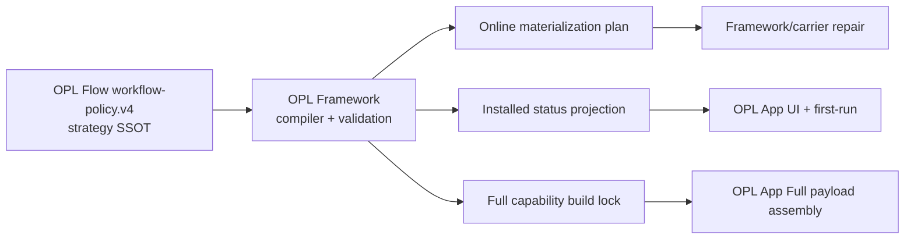

# OPL Flow Capability Governance

Owner: `OPL Flow`
Purpose: `capability_composition_architecture`
State: `active_source_architecture_ssot`
Machine boundary: `contracts/workflow-policy.json`, current source/tests, and
fresh Framework/carrier/executor readback own policy bytes, projections,
installed state, callability, publication, and release qualification.

## Decision

OPL Flow is the sole strategy owner for the default Codex working experience.
The policy covers:

- the user Profile and eight Flow-owned core workflow Skills;
- recommended model and reasoning intent;
- default Skills and Tools, their source owners, installation intent, and
  degradation behavior;
- optional enhancement discovery;
- online repair and Full/offline selection intent;
- readiness adapters and capability bundles.

Framework is the generic compiler and runtime owner for that strategy. It
validates the Flow policy, compiles materialization/status/build-lock
projections, invokes owner-supported adapters, installs or repairs selected
capabilities, and reads back effective state.

OPL App is a consumer. It renders Framework status, starts generic Framework
actions, and materializes a pinned Full build lock. It does not parse
`workflow-policy.json`, choose the default capability set, or maintain a second
recommended-Skill catalog.

This is the lowest-cognition architecture because a default capability change
has one authoring location and only generated consumers:



No reverse edge may make App or Framework policy the semantic owner.

## Authority Map

| Surface | Owner | Consumer boundary |
| --- | --- | --- |
| Default capability identity, grouping, source, criticality, install intent, distribution intent, and degradation semantics | OPL Flow | Framework compiles; App never duplicates |
| Core Flow Plugin/Profile/Skills payload | OPL Flow | Framework/carrier installs and reads back |
| Generic policy parser, compiler, materializer, repair, status, and build lock | OPL Framework | Must remain data-driven and reject unknown policy fields |
| Owner-specific repair adapter | Capability owner, invoked by Framework | Example: `agent-reach skill --install` |
| App Auto model resolution, UI, persistence, explicit user choice, and fallback | OPL App | Installed Flow recommendation is an input, not App-owned policy |
| Standard/Full product assembly and release evidence | OPL App | Full consumes a Framework-generated lock; it does not select capabilities |
| Effective `AGENTS.md` and explicit settings | User | Flow proposes safe merge; user overrides win |
| Optional architecture/reliability/domain methods | OPL Skills or domain package | Absence must not block Flow |
| Private Ledger/Fleet topology and state | OPL Instance | Public Flow supplies reusable engines only |

## Policy Model

`contracts/workflow-policy.json` uses `opl_flow_workflow_policy.v4` and separates
five concerns:

1. `provides`: the Plugin/Profile and eight Flow-owned core Skills.
2. `requires`: dependencies whose absence can make Flow itself non-operational.
3. `experience_baseline`: default/recommended capabilities. Absence degrades
   the experience but never disables Flow, Ledger, or core Skills.
4. `compatible_optional`: discoverable enhancements with no default install or
   repair obligation.
5. `capability_bundles`: user-meaningful groups whose members still retain
   independent source, lifecycle, readiness, and distribution metadata.

The three status planes are intentionally independent:

- `package_operational`: Flow is installed and callable, including `requires`.
- `experience_baseline`: default capabilities are current or `degraded`.
- `specialized_capabilities`: optional enhancements are present or absent.

`experience_baseline=degraded` must not be translated into
`package_operational=unavailable`.

## Current Bundles

| Bundle | Relationship | Members | Online default | Full seed |
| --- | --- | --- | --- | --- |
| Internet research | experience baseline | Agent Reach Skill + CLI | owner-supported install/repair | none |
| Office authoring | experience baseline | OfficeCLI Skill family + CLI | Framework materialization | OfficeCLI CLI only |
| Document extraction | experience baseline | MinerU extractor Skill + CLI | Framework materialization | `mineru-open-api` CLI only |
| Visual design | experience baseline | `ui-ux-pro-max` | Framework materialization | none |
| Architecture enhancement | compatible optional | `architect-and-simplify` | observe only | none |
| Official Codex Office runtime | compatible optional | OpenAI Office/PDF runtime capability | observe only | none |

`offline_bundle=full` is the only Flow-owned Full selection signal. The current
Full plan therefore contains exactly `cli:officecli` and
`cli:mineru-open-api`. App source manifests may provide version or repository
hints for a selected adapter, but they cannot add an item to this plan.

## Agent Reach

Agent Reach is part of the Codex experience baseline, not a Flow runtime
dependency.

- Flow declares both its Skill entrypoint and CLI/doctor readiness.
- Framework uses the owner CLI for managed setup and repair.
- Readiness checks cover the Skill payload, CLI version, `doctor --json`, and
  the core channels defined by the owner adapter.
- Missing or unhealthy Agent Reach sets the internet-research bundle and
  `experience_baseline` to `degraded`, while Flow remains operational.
- `opl system initialize --json` derives `recommended_skills` from the
  installed Flow strategy projection, so App first-run sees Agent Reach without
  an App-owned catalog.

Credentials and authenticated optional channels remain user/provider owned and
are never bundled.

## Core Skills And OPL Skills

Skills that define the default Codex work style or Flow's multi-task,
multi-repository, multi-machine control path belong in OPL Flow. The current
eight-Skill core set is:

- `opl-flow`;
- `coordinate-concurrent-tasks`;
- `codex-app-owner-migration`;
- `develop-and-deliver`;
- `github-ssot-patrol`;
- `recover-codex-tasks`;
- `task-mode-gate`;
- `opl-fleet`.

OPL Skills remains an independently installable enhancement pack. Its catalog
categories are for browsing, not implicit installation defaults. In
particular, both the `development` methods and the six `architecture-lenses`
are development-related. Flow therefore does not resolve "development
enhancements" to only one category.

The named `development-complete` preset is an explicit union of:

- `architect-and-simplify`, `zoom-out`,
  `improve-codebase-architecture`, `grill-with-docs`, and `prototype`;
- all six `book-*` architecture lenses.

Flow passes the resolved exact IDs to the OPL Skills owner-supported installer.
It never uses wildcard installation. `architect-and-simplify` is
capability-aware: use it when installed; otherwise perform the same judgment
model-natively and do not block the task.

## Model And Profile

Flow recommends `gpt-5.6-sol` with `max` reasoning. The precedence is:

```text
explicit user selection
> installed Flow recommendation
> fresh Codex model catalog/default
> App fallback when Flow is unavailable
```

App owns Auto resolution, visible controls, persistence, and fallback. Flow
owns the recommendation only; it cannot claim an unavailable model is usable.

Profile mutation preserves user ownership through backup, semantic merge,
target-hash stale-write protection, validation, atomic replace, and readback.
Flow never injects a hidden base prompt.

## Install, Setup, And Start

Package installation, update, and repair deploy capabilities only. They may
install the Flow Plugin/Profile/core Skills and materialize the current
experience baseline. They must not create a Dashboard, Bead, Linear Project,
or Automation.

- `$opl-flow setup` establishes or repairs the Codex experience baseline and
  optional enhancement selection.
- `$opl-flow start` is the explicit formal onboarding action. It idempotently
  creates or reuses the Dashboard task, unique Ledger Bead, registered Linear
  project projection, and one hourly `OPL Flow Supervisor`.

Installing Flow never implies that `start` has run.

## Framework Projection Contract

Framework emits generic, machine-readable surfaces:

- `opl_flow_capability_strategy_projection.v1`: policy identity, bundle state,
  online materialization plan, Full distribution plan, and health adapters;
- package status at
  `app_state.agent_packages.status_index.packages.opl-flow.capability_strategy`;
- `system_initialize.recommended_skills`, derived from the installed strategy;
- `opl_flow_capability_build_lock.v1`, binding one Full strategy digest to the
  resolved source ref, version, and SHA-256 of every selected payload.

Managed mode may invoke owner-supported install/repair adapters. Observe mode
must not write. If no installed Flow-derived plan exists, companion
materialization is a true `0/0` no-op rather than a fallback static catalog.

App Full assembly accepts only adapters it implements, materializes exactly the
build-lock items, and fails closed on unknown, missing, duplicate, drifted, or
unselected payloads. The runtime receipt records the pre-materialization source
hash and the packaged payload hash after native trust processing.

## Change Process

To add, remove, or change a default capability:

1. edit the Flow policy and schema/tests;
2. compile it with Framework and inspect online, status, and Full projections;
3. add a generic Framework adapter only when the capability kind or owner
   protocol is genuinely new;
4. update an App adapter only when a newly selected Full payload needs product
   assembly support;
5. verify Flow-only, degraded baseline, online repair, Full build-lock, and App
   consumer paths;
6. read back canonical source and, when authorized separately, installed or
   published state.

Do not patch an App `recommended_skills` list or restore a Framework static
catalog. Those are symptoms of authority duplication.

## Terminal Boundary

Source, tests, task branches, build locks, and dry runs prove implementation
only. They do not prove publication, installation, App release, or effective
machine state. Each terminal claim requires the corresponding owner readback.
