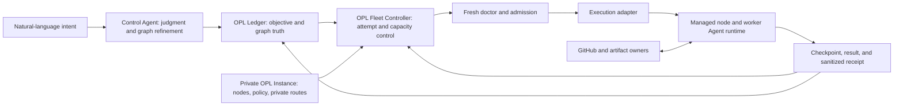

# OPL Fleet Product And Architecture

Owner: `OPL Flow`
Purpose: `fleet_product_target_architecture`
State: `active_target_architecture_ssot`
Machine boundary: Current contracts, source, private Instance policy, and fresh
node/executor readback own implemented behavior and effective fleet state.

## Positioning Decision

OPL Fleet is an open, general Agent-native distributed execution and continuity
control plane, initially optimized for a person's or small team's heterogeneous
machines.

It turns independently managed computers into one evidence-bound execution
fleet for Agent work. A task can be admitted, executed, checkpointed, recovered,
or moved to another machine without making one conversation, checkout, or host
the task's identity.

The useful era framing is:

| Computing era | Representative control system | Primary managed unit |
| --- | --- | --- |
| HPC | Slurm-class job scheduling | batch job and allocated compute resources |
| Cloud | Kubernetes-class container orchestration | containerized workload and desired service state |
| Agent | OPL Fleet's target control plane | durable Agent objective, execution owner, context boundary, policy, budget, dynamic task graph, and lifecycle |

This is a product framing, not an exhaustive history or a claim that one system
defines an entire era. Agent frameworks, durable workflows, distributed
execution engines, and managed Agent runtimes already exist. Their capabilities
remain fragmented, however, and no open general Agent-native control plane has
yet become a broadly adopted common layer across heterogeneous machines and
execution backends.

OPL Fleet reuses HPC, cloud, container, workflow, CI, SSH, and native Agent
runtimes as execution adapters where appropriate. Its distinct responsibility
is the control state that an Agent task needs across machines:

- a durable objective identity outside any one conversation;
- exactly one current execution owner, with compare-and-swap transfer;
- a reproducible Agent, tool, Skill, repository, and workspace baseline;
- versioned context references and recovery boundaries without centralizing raw
  conversations;
- least-privilege authorization and enforceable time, token, cost, and resource
  budgets;
- a dynamic task graph whose objective truth remains in the Ledger;
- fresh capability and policy admission before execution;
- checkpoint, result, and unknown-outcome semantics;
- evidence that the intended task, not merely a process, reached its terminal
  outcome.

The product opportunity is the missing integration of task truth, Agent runtime
currentness, context continuity, permission and budget enforcement, dynamic
task graphs, heterogeneous machines, owner continuity, and terminal evidence in
one local-first control plane.

### Agent Manages Agent

"Agent manages Agent" means a control Agent can accept natural-language intent,
maintain or refine the Ledger task graph, select an execution strategy, and
supervise worker Agent attempts through Fleet. Deterministic contracts still
guard identity, permission, budget, leases, checkpoints, and terminal readback.
It does not mean unconstrained Agent autonomy.

```text
human natural-language intent
  -> control Agent judgment and dynamic task graph
  -> deterministic Fleet admission, permission, budget, and lifecycle guards
  -> worker Agent execution
  -> checkpoint, evidence, result, and next control decision
```

## Why Agent-Native Is Different

| Concern | Traditional job-oriented system | OPL Fleet responsibility |
| --- | --- | --- |
| Stable identity | Job, command, container, or workflow run | Durable objective plus replaceable execution attempt |
| Owner | Queue, service account, or worker | One current Agent execution owner bound to task/thread/run identity |
| Context | Input files, environment, or workflow state | Versioned context manifest, checkpoint references, provenance, and restore boundary |
| Permission and budget | Account quota, namespace policy, and resource limit | Task-scoped capabilities plus time, token, cost, and resource envelopes |
| Task graph | Job array or workflow DAG | Ledger-owned graph that a control Agent may refine while Fleet executes guarded attempts |
| Environment | Image, module, package, or runner label | Compatible Agent runtime, Profile, Skills, repositories, workspace, and tools |
| Admission | Resources, quota, labels, and policy | Resources plus fresh node state, task policy, workspace currentness, and owner lease |
| Continuity | Retry, requeue, restart, or workflow resume | Checkpoint and execution-owner transfer without requiring conversation migration |
| Completion | Exit status and artifacts | Executor result plus task-level readback from the owning authority |

The systems are complementary. Slurm, Kubernetes, Ray, cloud batch, GitHub
Actions, SSH, and native Codex task connections may all be useful Fleet
adapters. Fleet should not reimplement their strongest primitives.

## Authority Model



The boundaries are strict:

| Authority | Owns | Must not own |
| --- | --- | --- |
| OPL Ledger / Beads | objective, dynamic task graph, dependencies, current execution owner, context/checkpoint references, budget intent, remaining work, terminal result | machine topology, capacity leases, credentials |
| OPL Fleet Controller | node admission, selection, protected capacity, execution-attempt identity, scoped permission and budget enforcement, adapter invocation, migration safety, sanitized attempt receipts | a second task database, source authority, raw prompts, conversation history |
| Private OPL Instance | approved nodes, personal policy, desired workspace profile, private route references, sanitized receipts | public engine code, live credentials, raw logs |
| Managed node | owner-installed runtimes, local caches, task checkout/worktree, local execution | fleet-wide task truth or another node's private state |
| GitHub and artifact owners | canonical source, checkpoints, delivery evidence, immutable artifacts | task ownership or node admission |
| Fleet Agent / Gateway / Cockpit | node observation and read-only projections | leases, dispatch, owner claims, or completion decisions |

Fleet capacity and execution attempts are not task truth. The Ledger remains the
stable task identity. A Fleet attempt may disappear or be replaced while the
objective remains current and recoverable.

## Agent Task Lifecycle

The target lifecycle is:

```text
declare objective and requirements
  -> prepare compatible workspace
  -> fresh doctor and admit node
  -> acquire owner/capacity lease
  -> execute through one adapter
  -> checkpoint or produce a terminal result
  -> read back task-level evidence
  -> release or reconcile the attempt
```

Cross-machine continuation transfers the execution owner, not necessarily the
conversation:

```text
freeze source writes
  -> publish a recoverable checkpoint
  -> prove target environment and Git currentness
  -> atomically claim the same objective on the target
  -> create or reuse an Agent execution entry
  -> verify target progress and supersede the source owner
```

At most one execution owner may mutate a task's write set at a time. A new
conversation on another machine is a valid execution carrier when it claims the
same objective and checkpoint through this transaction.

## Current Design Assessment

The existing design is directionally sound and should be deepened rather than
replaced.

### Strong Existing Decisions

1. OPL Flow owns the reusable public engine; the private Instance owns topology
   and personal policy.
2. Static inventory is not availability. Fresh `doctor` evidence precedes
   admission and dispatch.
3. Protected capacity uses owner-bound leases, TTLs, verification, and explicit
   release or reconciliation.
4. Execution adapters are explicit. Local Codex, SSH, GitHub Runner, native
   remote Codex, and lease-only capacity do not pretend to share one execution
   mechanism.
5. Nodes install and update components from their current owners. Fleet does
   not copy controller checkouts, credentials, sessions, or Skill trees.
   Scheduled reconciliation observes missing Skills and reports the declared
   owner action; it does not invoke the Skills CLI's global route or create a
   second user-level Skill root.
6. Beads/Dolt owns durable task truth, GitHub owns delivery evidence, and Fleet
   owns admission/capacity. This prevents a second truth source.
7. Unknown transport outcomes fail closed, and observability products remain
   read-only rather than becoming hidden scheduling authorities.

### Active Architecture Work

The reusable Codex App owner-migration route is provided by
`manage-codex-tasks` mode `migrate-owner`. It treats the Codex App task as a
replaceable visible executor handle while Beads/Dolt remains objective truth.
The route does not claim availability from SSH or a headless CLI process: the target host,
complete profile repository set, and readable target task must be visible in the
native App before the owner CAS can proceed. Workspace bootstrap/currentness,
CAS migration, and real cross-machine readback remain fail-closed runtime gates;
when those gates are unavailable, the source owner continues locally.

The target workspace profile is declared by the private Instance and binds
nodes, a workspace root, an environment contract, an explicit repository
allowlist, and Automation placement. Missing repositories are staged and cloned
from their canonical owners. Existing repositories admit work only after fresh
fetch/currentness checks; dirty, ahead, diverged, detached, task-branch,
remote-mismatch, active-worktree, or stale-control states fail closed.

The target owner migration state machine is:

```text
source_checkpointed -> target_preflighted -> target_acknowledged
  -> target_verified -> completed
```

The atomic claim is the only owner mutation. It updates the Ledger execution
owner, thread handle, node, and claim generation after a fresh workspace
preflight. Once the target has claimed the objective, recovery uses a new
reverse migration rather than an automatic rollback that could restore two
writers. Ordinary objective migration does not move Automations. Singleton
Supervisor placement requires old-disabled readback before new-active readback.

Each owner mutation follows pull, exact read, one metadata mutation, push, then
pull/readback. An unknown push outcome is reconciled read-only before any new
write. Repository bytes come from canonical Git remotes; private credentials,
sessions, chat text, worktrees, binaries, caches, logs, and local absolute paths
are not copied between nodes.

## Optimization And Missing Capabilities

| Rank | Capability | Why it matters | Smallest owner-correct implementation |
| --- | --- | --- | --- |
| Strong | Agent execution-attempt contract | Resource requirements alone do not bind objective revision, checkpoint, write set, expected result, or recovery route | Extend the existing Bead requirements and dispatch receipt with one versioned attempt identity; do not add another database |
| Strong | Workspace and runtime compatibility | A reachable machine is not ready if its Agent baseline or repositories have drifted | Reconcile an Instance-declared compatible profile, then require fresh Git/currentness readback before claim |
| Strong | Execution-owner migration and recovery | Task continuity is the core difference from ordinary remote command execution | Use source freeze, checkpoint, target CAS claim, verify, supersede, and fail-closed unknown-state recovery |
| Strong | Context, artifact, and checkpoint references | Bounded stdout cannot carry context, large task state, or non-code outputs | Use a versioned context manifest and content-addressed references to owner-managed Git/object/relay artifacts; verify digests rather than making Fleet a raw context or blob store |
| Strong | Permission and budget envelope | Agent work needs bounded authority as well as bounded compute | Bind opaque credential references, capability scopes, time/token/cost/resource limits, and terminal budget use into each attempt without exposing secret values |
| Strong | Dynamic task groups and fan-out/fan-in | A control Agent must refine and execute several coordinated slices, not only select one node | Let the Ledger own the graph and child objectives; add group dispatch receipts over existing single-node transactions after a real consumer proves the shape |
| Worth exploring | Resumability and preemption contract | A lease can expire without proving whether an Agent task can resume safely | Declare checkpointability, heartbeat, interruption phase, resume command, and maximum stale interval per attempt |
| Worth exploring | Attempt-aware observability | Host telemetry alone cannot explain task migration, stalls, or repeated failure | Emit sanitized attempt IDs, phases, timestamps, and result classes; keep prompts, outputs, paths, and secrets out of telemetry |
| Worth exploring | Queueing and backpressure | Contention will eventually exceed direct selection plus leases | Add a durable queue only when simultaneous demand proves it necessary; until then, keep queue intent in the Ledger |
| Speculative | Cost, energy, locality, and speculative execution | Useful at larger scale but not required to prove the product | Add policy inputs after task duration and failure data exist; do not build an optimizer from assumptions |

## What Not To Build

The positioning does not justify:

- a replacement for Kubernetes, Slurm, Ray, Temporal, CI, or cloud batch;
- a second DAG/task database beside Beads/Dolt;
- a central prompt, conversation, credential, or raw-log store;
- a custom package manager or controller-to-node software copier;
- exact-version lockstep when component-owner compatibility is sufficient;
- a general artifact service before content-addressed owner references prove
  insufficient;
- a global queue, optimizer, or autoscaler before real contention requires it.

## Product Acceptance

The positioning is real only when these behaviors are demonstrated:

1. A managed objective can start on one node and continue on another while
   retaining one stable Ledger identity and exactly one current execution owner.
2. The target node reconstructs a compatible Agent/workspace baseline from
   declared owners and canonical Git sources, not from another node's checkout.
3. Dispatch binds the objective revision, requirements, checkpoint, owner,
   context manifest, permission/budget envelope, adapter, lease, and recovery
   route into one verifiable attempt.
4. A known result reaches the task's terminal authority before capacity is
   released; an unknown result is reconciled before retry.
5. Offline, stale, drifted, busy, or incompatible nodes are excluded with an
   explicit reason rather than silently skipped or treated as completed.
6. A control Agent can refine a Ledger-owned task graph and supervise worker
   attempts without bypassing deterministic identity, permission, budget,
   lease, and terminal gates.
7. Fleet receipts and telemetry disclose no prompts, conversations,
   credentials, private routes, raw logs, or exhaustive machine state.

Until those surfaces have fresh source and runtime evidence, documentation must
label them as active work or roadmap rather than implemented capability.
